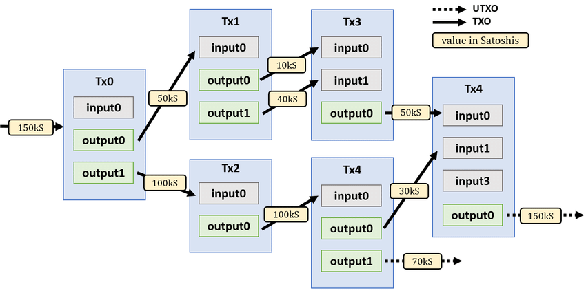
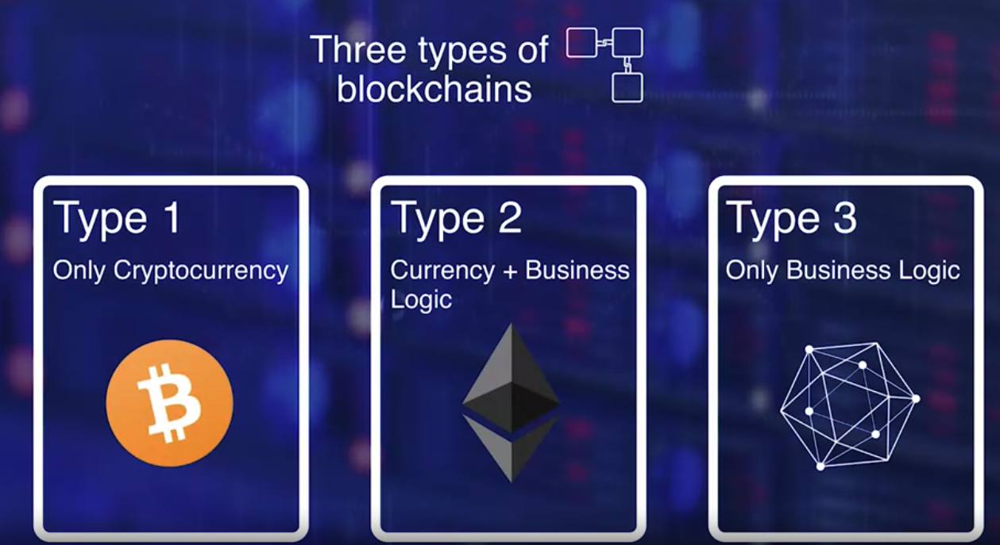

# Course provided by Coursera
* [Course Link](https://www.coursera.org/learn/blockchain-basics?specialization=blockchain)

# Module 1: Bitcoin & Blockchain

## What is a Blokchain?

* Blockchain enables peer to peer transfer of digital assets without any intermediaries
* Technology originally created to support the famous cryptocurrency. Ex: Bitcoin
* The blockchain is posed to innovate and transform a wide range of applications
  * Goods Transfer. Ex: Supply Chain
  * Digital media transfer. Ex: Sale of Art
  * Remote Services Delivery. Ex: Travel and Tourism
  * Platform for decentralized business logic. Ex: Moving computing to data sources

* Learning Objectives:
  * Explain three fundamental characteristics that define a blockchain
  * Explain the important features of Ethereum blockchain
  * Explain algorithms and techniques that enable a blockchain
  * Outline methods for realizing trust in a blockchain

### Bitcoin

* Digital currency system
* Autonomouns decentralized application
* Satoshi Nakamoto introduced Bitcoin
* Peer to peer transfer without a center authority
* Implements software programs for validation, verification, consesus in a novel infrastructure called the blokchain
* What is a blockchain?
  * Enables peer to peer transaction in a decentralized network.
  * Establishing trust among unknown peers.
  * Recording the transaction in a n immutable distributed ledger.
  
### Centralzied versus Decentralized

* Consider a scenario where customer wants to buy an item using her credit card.
  * Let's enumerate the intermediaries involved in accomplishing this task. We have a credit card agency, we have a customer bank, we have a credit cards bank, we have an exchange, we have the merchant's bank, and finally, the merchant. This is an example of a centralized system that we are so used to.

* Now compare this with a system where peers can transact directly with each other irrespective of where they are located. Functions of the intermediaries are shifted to the periphery to the peer participant in the blockchain infrastructure. Peers are not necessarily known to each other. This is a decentralized system. 

### Establishing Trust

* Process in place to validate, verify and confirm transactions
* Record the transaction in a distributed ledger of blocks, create a tamper-proof record of blocks, chain of blocks, and implement a consensus protocol for agreement on the block to be added to the chain.
* **Validaiton**, **veriricaction**, **consesus**, and **immutable recording** lead to the trust and security of the blockchain.

### Resources:

* [Bitcoin Whitepaper](https://bitcoin.org/bitcoin.pdf)
* [Bitcoin's Academic Pedigree](https://queue.acm.org/detail.cfm?id=3136559)
* [What is Blockchain Technology? A Step-byStep Guide For Beginners](https://blockgeeks.com/guides/what-is-blockchain-technology/) 
* [Blockchain: The Invisible Technology That's Changing the World](https://www.pcmag.com/news/blockchain-the-invisible-technology-thats-changing-the-world)

## Blockchain Structure

* Transaction is the basic elemnt of the Bitcoin Blockchain
* Transaction -> Validate & Broadcast
* Many transactions form a block - Many box form a chain through a digital data link
* Blocks go through a Consensus process to select the next block that will be added to the chain
* Chosen block is verified, and added to the current chain.
* Validation and consensus process are carried out by special peer nodes called miners;

### Single Transaction in Bitcoin

* Fundamental concept of a bitcoin netowrk is an **Unspent Transaction Output**, also knwon as **UTXO**

#### Unspent Transaction Output - UTXO

* Referenced as inputs in a transaction.
* Also outputs generated by a transaction.
* Structure of a given UTXO:
  * Unique identifier of the transaction that created the UTXO
  * Index or the position of the UTXO in the tnrasaction output list
  * Value of that amount
  * Optional: conditions under which output can be spent

#### Transaction (Tx):
* 1 - Reference number of the current transaction
* 2 - Reference(s) to one or more input UTXOs
* 3 - Reference(s) to one or more output UTXOs newly generated by the current transaction
* 4 - Total input amount and output amount

[BTC BLOCK ZEROU - Where all began](https://www.blockchain.com/explorer/blocks/btc/000000)

* Summarize
  * The concept of UTXO defines the inputs and outputs of such a transaction. Once a block is verified an algorithmic-ally agreed upon by the miners, it is added to the chain of blocks, namely the Blockchain.
  * UTXO are not spent during a transaction. UTXO's serve as inputs to a new transaction

### Resources

* [Unspent Transaction Output, UTXO](https://academy.binance.com/en/glossary/unspent-transaction-output-utxo)

### Quiz

1 - a block in a Blockchain has a header and Transactions
2 - UTXO stands for Unspent Trnasaction Output
3 - A transaction generates new UTXOs for transferring the amount specified in the input UTXOs. True
4 - Miners are computers that execute - operations defined by the blockchain protocol

## Basic Operations

* Operations in the decentralized network are the responsibility of the peer participants and their respective computational nodes.

* Operations:
  * Validation of transactions
  * Gathering transactions for a block
  * Broadcasting valid transactions and blocks
  * Consensus on next block creation
  * Chaining blocks

* Participants - Two major roles for participants
  * Participants that initiate transfer of value by creating a transaction
  * Miners - incentivised with bitcoins
    * Verify transactions
    * Broadcast transactions
    * Compete to create a block
    * Reach consensus by validating block
    * Broadcast new block
    * Confirm transactions

* Algorithm for consensus is called proof-of-work protocol
  * Involves work a computational power to solve the puzzle and to claim the right to form the next block
  * Trnsaction zero
  * index zero of the confirmed block is created by the miner of the block
  * Special output UTXO and does not have any input UTXO
  * Called coinbase transaction that generates a minor's fees for the block creation.
  * Minor's fees is 12.5 BTC for a bitcoin - This is how new coin is minted in bitcoin

### Reading Resources

* [How Bitcoin Works investopedia.com](https://www.investopedia.com/news/how-bitcoin-works/)

* [How does the Blockchain Work? (Part 1)](https://medium.com/blockchain-review/how-does-the-blockchain-work-for-dummies-explained-simply-9f94d386e093)

* [How Does the Blockchain Work?](https://onezero.medium.com/how-does-the-blockchain-work-98c8cd01d2ae)

* [How Do Bitcoin Nodes Verify Transactions?](https://smartereum.com/8970/how-do-bitcoin-nodes-verify-transactions/)

### Quiz

* 1 - The algorithm for consensus in the Bitcoin blockchain is called Proof of Work protocol
* 2 - Transaction confirmation is independently performed by all miner nodes. True

* 3 - Transaction - in every block in the bitcoin blockchain **is for paying the miner fees, does not have any input UTXO ,and is called coinbase transaction**

## Beyond Bitcoin

* [Bitcoin blockchain is open-source and the entire code is available on the Github.](https://github.com/bitcoin/bitcoin)
* Bitcoin supports an optional and special feature called scripts for conditional transfer of values.
  * Ethereum Blockchain extended the scripting feature into a full-blown code execution framework called smart cotnract.
  * A smart contract provide the very powerful capability of code execution for embedding business logic ont he blockchain.

* Three major types of blockchains emerge from Bitcoin foundation.
  * 1 - Deals with the coins in cryptocurrency currency chain. Ex: Bitcoin
  * 2 - Supports cryptocurrency and a business logic layer supported by code execution. Ex: Ethereum
  * 3 - Involves no currency but supports software execution for business logic. Ex: The Linux Foundation's Hyperledger.

* With the addition of code execution, comes the serious consideration about public access to the blockchain hence, the classification of public, private, and permissioned blockchains based on access limits.

* Blockchain Categories
  * Public blockchain - Ex: Bitcoin
    * Anybody can join and leave as they wish.
    * Transaction blocks and the blockchain are publicly observable even though participants are anonymouns
    * Open-source
  * Private Blockchain
    * Access limited to slected participants. Ex: Participants within an organzation
    * Helps in simplifying the nromal operations such as block creation and contingence model.
  * Permissioned blockchain / Consortium blockchain
    * It is meant for a consortium of collaborating parties to transact on a blockchain for ease of governance, provenance, and accountability for example, a consortium of all automobile companies or healthcare organizations.
    * It has the benefits of a public blockchain with allowing only users with permission to collaborate and transact.

### Reading Resources

* [A Gentle Introduction to Blockchain Technology](https://bitsonblocks.net/2015/09/09/gentle-introduction-blockchain-technology/)
* [On Public and Private Blockchains](https://blog.ethereum.org/2015/08/07/on-public-and-private-blockchains)
* [What is Cryptocurrency. Guide for Beginners](https://cointelegraph.com/bitcoin-for-beginners/what-are-cryptocurrencies#accept-as-payment-for-business)
* [2017 Was Bitcoin's Year. 2018 Will Be Ethereum's](https://www.coindesk.com/markets/2017/12/27/2017-was-bitcoins-year-2018-will-be-ethereums/)
* [What is Cryptocurrency: Everything You Need To Know](https://blockgeeks.com/guides/what-is-cryptocurrency/)
* [What is the Difference Between Public and Permissioned Blockchains?](https://www.coindesk.com/learn/how-does-blockchain-technology-work/)