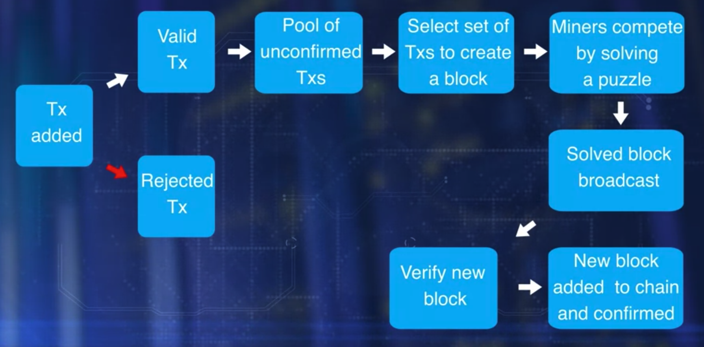

# Course provided by Coursera
* [Course Link](https://www.coursera.org/learn/blockchain-basics?specialization=blockchain)

# Module 1: Blockchain Defined

## Bitcoin & Blockchain

## What is a Blokchain?

* Blockchain enables peer to peer transfer of digital assets without any intermediaries
* Technology originally created to support the famous cryptocurrency. Ex: Bitcoin
* The blockchain is posed to innovate and transform a wide range of applications
  * Goods Transfer. Ex: Supply Chain
  * Digital media transfer. Ex: Sale of Art
  * Remote Services Delivery. Ex: Travel and Tourism
  * Platform for decentralized business logic. Ex: Moving computing to data sources

* Learning Objectives:
  * Explain three fundamental characteristics that define a blockchain
  * Explain the important features of Ethereum blockchain
  * Explain algorithms and techniques that enable a blockchain
  * Outline methods for realizing trust in a blockchain

### Bitcoin

* Digital currency system
* Autonomouns decentralized application
* Satoshi Nakamoto introduced Bitcoin
* Peer to peer transfer without a center authority
* Implements software programs for validation, verification, consesus in a novel infrastructure called the blokchain
* What is a blockchain?
  * Enables peer to peer transaction in a decentralized network.
  * Establishing trust among unknown peers.
  * Recording the transaction in a n immutable distributed ledger.
  
### Centralzied versus Decentralized

* Consider a scenario where customer wants to buy an item using her credit card.
  * Let's enumerate the intermediaries involved in accomplishing this task. We have a credit card agency, we have a customer bank, we have a credit cards bank, we have an exchange, we have the merchant's bank, and finally, the merchant. This is an example of a centralized system that we are so used to.

* Now compare this with a system where peers can transact directly with each other irrespective of where they are located. Functions of the intermediaries are shifted to the periphery to the peer participant in the blockchain infrastructure. Peers are not necessarily known to each other. This is a decentralized system. 

### Establishing Trust

* Process in place to validate, verify and confirm transactions
* Record the transaction in a distributed ledger of blocks, create a tamper-proof record of blocks, chain of blocks, and implement a consensus protocol for agreement on the block to be added to the chain.
* **Validaiton**, **veriricaction**, **consesus**, and **immutable recording** lead to the trust and security of the blockchain.

### Resources:

* [Bitcoin Whitepaper](https://bitcoin.org/bitcoin.pdf)
* [Bitcoin's Academic Pedigree](https://queue.acm.org/detail.cfm?id=3136559)
* [What is Blockchain Technology? A Step-byStep Guide For Beginners](https://blockgeeks.com/guides/what-is-blockchain-technology/) 
* [Blockchain: The Invisible Technology That's Changing the World](https://www.pcmag.com/news/blockchain-the-invisible-technology-thats-changing-the-world)

## Blockchain Structure

* Transaction is the basic elemnt of the Bitcoin Blockchain
* Transaction -> Validate & Broadcast
* Many transactions form a block - Many box form a chain through a digital data link
* Blocks go through a Consensus process to select the next block that will be added to the chain
* Chosen block is verified, and added to the current chain.
* Validation and consensus process are carried out by special peer nodes called miners;

### Single Transaction in Bitcoin

* Fundamental concept of a bitcoin netowrk is an **Unspent Transaction Output**, also knwon as **UTXO**

#### Unspent Transaction Output - UTXO

* Referenced as inputs in a transaction.
* Also outputs generated by a transaction.
* Structure of a given UTXO:
  * Unique identifier of the transaction that created the UTXO
  * Index or the position of the UTXO in the tnrasaction output list
  * Value of that amount
  * Optional: conditions under which output can be spent

#### Transaction (Tx):
* 1 - Reference number of the current transaction
* 2 - Reference(s) to one or more input UTXOs
* 3 - Reference(s) to one or more output UTXOs newly generated by the current transaction
* 4 - Total input amount and output amount

[BTC BLOCK ZERO - Where all began](https://www.blockchain.com/explorer/blocks/btc/000000)

* Summarize
  * The concept of UTXO defines the inputs and outputs of such a transaction. Once a block is verified an algorithmic-ally agreed upon by the miners, it is added to the chain of blocks, namely the Blockchain.
  * UTXO are not spent during a transaction. UTXO's serve as inputs to a new transaction

### Resources

* [Unspent Transaction Output, UTXO](https://academy.binance.com/en/glossary/unspent-transaction-output-utxo)

### Quiz

1 - a block in a Blockchain has a header and Transactions
2 - UTXO stands for Unspent Trnasaction Output
3 - A transaction generates new UTXOs for transferring the amount specified in the input UTXOs. True
4 - Miners are computers that execute - operations defined by the blockchain protocol

## Basic Operations

* Operations in the decentralized network are the responsibility of the peer participants and their respective computational nodes.

* Operations:
  * Validation of transactions
  * Gathering transactions for a block
  * Broadcasting valid transactions and blocks
  * Consensus on next block creation
  * Chaining blocks

* Participants - Two major roles for participants
  * Participants that initiate transfer of value by creating a transaction
  * Miners - incentivised with bitcoins
    * Verify transactions
    * Broadcast transactions
    * Compete to create a block
    * Reach consensus by validating block
    * Broadcast new block
    * Confirm transactions

* Algorithm for consensus is called proof-of-work protocol
  * Involves work a computational power to solve the puzzle and to claim the right to form the next block
  * Trnsaction zero
  * index zero of the confirmed block is created by the miner of the block
  * Special output UTXO and does not have any input UTXO
  * Called coinbase transaction that generates a minor's fees for the block creation.
  * Minor's fees is 12.5 BTC for a bitcoin - This is how new coin is minted in bitcoin

### Reading Resources

* [How Bitcoin Works investopedia.com](https://www.investopedia.com/news/how-bitcoin-works/)

* [How does the Blockchain Work? (Part 1)](https://medium.com/blockchain-review/how-does-the-blockchain-work-for-dummies-explained-simply-9f94d386e093)

* [How Does the Blockchain Work?](https://onezero.medium.com/how-does-the-blockchain-work-98c8cd01d2ae)

* [How Do Bitcoin Nodes Verify Transactions?](https://smartereum.com/8970/how-do-bitcoin-nodes-verify-transactions/)

### Quiz

* 1 - The algorithm for consensus in the Bitcoin blockchain is called Proof of Work protocol
* 2 - Transaction confirmation is independently performed by all miner nodes. True

* 3 - Transaction - in every block in the bitcoin blockchain **is for paying the miner fees, does not have any input UTXO ,and is called coinbase transaction**

## Beyond Bitcoin

* [Bitcoin blockchain is open-source and the entire code is available on the Github.](https://github.com/bitcoin/bitcoin)
* Bitcoin supports an optional and special feature called scripts for conditional transfer of values.
  * Ethereum Blockchain extended the scripting feature into a full-blown code execution framework called smart cotnract.
  * A smart contract provide the very powerful capability of code execution for embedding business logic ont he blockchain.

* Three major types of blockchains emerge from Bitcoin foundation.
  * 1 - Deals with the coins in cryptocurrency currency chain. Ex: Bitcoin
  * 2 - Supports cryptocurrency and a business logic layer supported by code execution. Ex: Ethereum
  * 3 - Involves no currency but supports software execution for business logic. Ex: The Linux Foundation's Hyperledger.

* With the addition of code execution, comes the serious consideration about public access to the blockchain hence, the classification of public, private, and permissioned blockchains based on access limits.

* Blockchain Categories
  * Public blockchain - Ex: Bitcoin
    * Anybody can join and leave as they wish.
    * Transaction blocks and the blockchain are publicly observable even though participants are anonymouns
    * Open-source
  * Private Blockchain
    * Access limited to slected participants. Ex: Participants within an organzation
    * Helps in simplifying the nromal operations such as block creation and contingence model.
  * Permissioned blockchain / Consortium blockchain
    * It is meant for a consortium of collaborating parties to transact on a blockchain for ease of governance, provenance, and accountability for example, a consortium of all automobile companies or healthcare organizations.
    * It has the benefits of a public blockchain with allowing only users with permission to collaborate and transact.

### Reading Resources

* [A Gentle Introduction to Blockchain Technology](https://bitsonblocks.net/2015/09/09/gentle-introduction-blockchain-technology/)
* [On Public and Private Blockchains](https://blog.ethereum.org/2015/08/07/on-public-and-private-blockchains)
* [What is Cryptocurrency. Guide for Beginners](https://cointelegraph.com/bitcoin-for-beginners/what-are-cryptocurrencies#accept-as-payment-for-business)
* [2017 Was Bitcoin's Year. 2018 Will Be Ethereum's](https://www.coindesk.com/markets/2017/12/27/2017-was-bitcoins-year-2018-will-be-ethereums/)
* [What is Cryptocurrency: Everything You Need To Know](https://blockgeeks.com/guides/what-is-cryptocurrency/)
* [What is the Difference Between Public and Permissioned Blockchains?](https://www.coindesk.com/learn/how-does-blockchain-technology-work/)

### Quiz

* 1 - In a public blockchain, a participant can join and leave the blockchain as and when they wish. True

## Week 1 Evaluation: Blockchain Defined

* Quiz Directions
  * Task 1: Understanding the Genesis Block (Q2-Q3)
    * In this task, you will explore the Genesis blocks (i.e. Block 0), for 2 different implementations of Blockchain, i.e. Bitcoin Blockchain (resource 1 or resource 2) and Ethereum Blockchain (resource 3). You need to check the previous block hash, transactions, and the reward.

  * Task 2: Exploring a block in the Bitcoin Blockchain (Q4-Q5)
    * In this task, you will inspect and explore block #490624 on either resource 1 or resource 2 provided above. Locate the hash of this block, the hash of the previous block, and the number of transactions in that block. You may explore other things contained in the block as well. After this, you will go to the previous block (by block number) and verify the hash of this block is the same as mentioned in the block you were exploring before.

* Quiz Resources
  * [Blockchain](https://www.blockchain.com/explorer)
    * Description: Blockchain is the world's leading software platform for digital assets. Offering the largest production blockchain platform in the world and using new technology to build a radically better financial system. You can use this website to explore and answer questions related to Bitcoin Blockchain.

  * [Bitcoin Block Explorer](https://www.blockexplorer.com/)
    * Description: Block Explorer is an open-source web tool that allows you to view information about blocks, addresses, and transactions on the Bitcoin blockchain. You can use this website to explore and answer questions related to Bitcoin Blockchain.

  * [Etherscan](https://etherscan.io/)
    * Description: EtherScan is a Block Explorer, Search, API, and Analytics Platform for Ethereum, a decentralized smart contracts platform. You can use this website to explore and answer questions related to Ethereum Blockchain.

  * Note: Use Blockchain or Bitcoin Block Explorer to explore Bitcoin Blockchain. Use Etherscan to explore Ethereum Blockchain. 

## Quiz:

* 1 - What is the genesis block?
  * Answer: The first block of a Blockchain
* 2 - Inspect and explore block #0 using https://www.blockchain.com/btc/block/0 to solve the below question. How many transactions are there in the Genesis block in Bitcoin?
  * Answer: 1
* 3 - Question 3 Inspect and explore block #0 using this link (https://etherscan.io/block/0) to solve the below question. How many transactions are there in the Genesis block in Ethereum (other than the transaction for Miner fee)?
  * Answer: 8893
* 4 - Inspect and explore block #490624 using this link (https://blockchain.info/block/000000000000000000d4c8b9d5388e42bf084e29546357c63cba8324ed4ec8bf) to solve the below question. What is the hash of the previous block for Bitcoin block #490624? Copy and paste the answer into the box below.
  * Answer: 0000000000000000004239f2a01d8f579bc0dbb214d0f874ece5db587bee3457
* 5 - Inspect and explore block #490624 using this link (https://www.blockchain.com/explorer/blocks/btc/000000000000000000d4c8b9d5388e42bf084e29546357c63cba8324ed4ec8bf) to solve the below question. Which of these fields is present in a Bitcoin block summary?
  * Answer: Difficulty
* 6 - Where are the transactions recorded in a blockchain?
  * On a distributed immutable ledger
* 7 - What are UTXOs in a Bitcoin Blockchain?
  * These form the input and outputs for transactions
* 8 - Blockchain was created to support security and trust in a  **DECENTRALIZED TRUSTLESS** environment of the cryptocurrency Bitcoin.
* 9 - What/Who are miners in a blockchain?
  * Computers that validate and process blockchain transactions and solve the cryptographic puzzle to add new blocks

## Bitcoin Mining

* [What is bitcoin mining?](https://www.investopedia.com/terms/b/bitcoin-mining.asp)

## Bitcoin Halving

* Halving is an important concept in Bitcoin mining. At first, the mining reward was 50 BTC for solving the hash. About every four years, or 210,000 blocks, the reward is cut in half. So rewards were cut to 25 in 2012, 12.5 in 2016, and 6.25 in 2020. The next halving is expected to occur in 2024, when the reward will reduce to 3.125, followed by a reduction to 1.5625 around 2028.

* The last bitcoin is expected to be mined somewhere around 2140. All 21 million bitcoins will have been mined at that time, and miners will depend solely on fees to maintain the network.

# Module 2: Ethereum Blockchain

## Ethereum Blockchain: Smart Contracts

* Around 2013, a framework for code execution was introduced by Ethereum Founders.

* Ethereum took a significant step towards transforming the blockchain into a computational framework that opened up a whole world of oppotunities in the decentralized realm.
* Ethereum supports smart contracts and virtual machine on which smart contracts execute.
* Smart contracts in turn enable decentralized applcication that accomplish more than a transfer of value

* What is a smart contract?
  * Pice of code deployed in the blockchain node;
  * Execution is initiated by a message embedded in the transaction;
  * Enables transaction that may carry out more sophisticated operations
    * E.g: A transaction could require a conditional transfer, it may requrie some evaluation, may need more than one transfer assets.

* How do you write a smart contract?
  * Structurally, s asmart contract resembles a class definition in an object oriented design.
  * It has data, fucntion or methods with modifiers public or private, along with getter and set of functions;
  * Specific programming languages have been designed for coding smart contracts;
    * Solidity is one such langauge

* pragma - indicates the version of the solidity language
* contract's name

* Where does the code in the smart contract get executed?
  * We need a computational infrastructure to execute any arbitrary code
  * Every node in Ethereum network should be able to execute the code irrespective of that underlying type of hardware or operating system

* Ethereum Virtual Machine, EVM
  * An EVM provides a run anywhere obstruction layer ofr the contract
  * A smart contract written a high level programming language is translated into EVM byte code, and then, deployed on the Ethereum Virtual Machine, EVM.
  * Every node will host the same smart contract codes on the EVM

### Resources:

* [What is Ethereum?](https://ethereum.org/en/what-is-ethereum)
* [Smart Contracts: The Blockchain Technology That Will Replace Lawyers](https://blockgeeks.com/guides/smart-contracts/)
* [Introduction to Smart Contracts](https://docs.soliditylang.org/en/develop/introduction-to-smart-contracts.html)

### Quiz:

* Question 1 - What allows for the execution of code in the Ethereum Blockchain, while enhancing the basic value transfer capability of the Bitcoin Blockchain?     
  * A: Smart Contracts

* Question 2 - Solidity has data, functions or methods with modifiers, along with getter and setter functions. True or False?
  * A: True

## Ethereum Structure

* Bitcoin blocking state was defined in terms of unspent transaction outputs UTXOs and a referente implementation of the Wallet application that held the account reference.

* Ethereum formally introduce the concept of an account as a part of the protocol
  * The account is the originator and the target of a transaction.
  * A transaction directly updates the account balances as opposed to maintaining the state such as in the bitcoin UTXOs.

* Accounts - 2 Types
  * Externally Owned Accounts or EOA
    * EOA are controlled by private keys
    * Needed to participate in the Ethereum network
    * Interacts with the blockchain using transactions
    * Has a coin balance
  * Contract Accounts or CA
    * CA are controlled by the code and can be activated only by an EOA
    * Represents a smart contract
    * Has a coin balance

* The participant node can send transaction for Ether transfer or it can send transaction to invoke a smart contract code or both.
  * Both types of transaction require fees
* An account must have sufficient balance to meet the fees needed for the transactions activated
  * Fees are paid in Wei
    * Wei is a lower denomination of Ether
    * One Ether 10 to the power of 18 Weis.

* Transaction in Ethereum includes:
  * The recipient of the message;
  * Digital signature of the sender authorizing the transfer
  * Amount of Wei to transfer
  * An optional data field or payload that contains a message to a contract
  * STARTGAS (maximum number of computational steps the transaction is allowed)
  * GASPRICE (fee for computations)

* Ethereum block structure:
  * Header
  * Transaction
  * Runner-up block headers
  * Block details

* [LINK](https://etherscan.io/block/4446308)

### Resources: Ethereum Structure

* [Ethereum Whitepaper: A Next-Generation Smart Contract and Decentralized Application Platform](https://ethereum.org/en/whitepaper)
* [Account Management](https://ethereum.org/en/developers/docs/accounts)
* [Native: Account management](https://geth.ethereum.org/docs/developers/dapp-developer/native-accounts)

### Quiz

* Question 1: How many types of accounts are on Ethereum?
  * A: 2
* Question 2: The **ACCOUNTS** can send transactions for ether transfer or they can send send transactions to invoke a smart contract code.

* Question 3: What is the smallest denomination of cryptocurrency on Ethereum?
  * A: Wei

## Ethereum Operations

* An Ethereum node is a computational system representing a **business entity** or an **individual participant**.
  * An Ethereum full node hosts the software needed for transaction initiation, validation, mining, block creation, smart contract exectuion and the invocation for a smart contract.
  * Smart contract is designed, developed, compiled and deployed on the EVM that can be more than one smart contract in an EVM.
  * When the target address in a transaction is a smart contract, the execution code corresponding to the smart contract is activated and executed on the EVM.
    * The input neeeded for this execution is extracted from the payload field of the transaction.

* Blockchain maintains both the stae hash and the receipt hash

* Transaction validation involves
  * Checking the time-stamp
  * The nonce combination to be valid
  * The availability of sufficient fees for execution

* Miner nodes
  * Receive;
  * Verify;
  * Gather;
  * Execute Transactions;
  * The in-work smart contract code are executed by all miners;
  * Validated transactions are broadcast and gathered for block creation;
  * The consensus protocol used is a memory-based rather than a CPU-based proof of work;

### Resources: Ethereum Operations

* [How Does Ethereum Work?](https://www.coindesk.com/learn/how-does-ethereum-work/)
* [What Is Meant By The Term "Gas"?](https://ethereum.stackexchange.com/questions/3/what-is-meant-by-the-term-gas)

### Quiz

* 1 - **ETHEREUM FULL NODE** hosts the software needed for transaction initiation, validation, mining, block creation, and smart contract execution;
* 2 - **MINER NODES** receive, verify, gather and execute transactions
* 3 - Any changes to the value of a state variable in a smart contract are stored on the blockchain.
  * A: True

## Incetive Model

* Ethereum uses an incentive-based model for block creation - Gas related in a transaction
  * Every action in Ethereum requires crypto fuel, or gas.
  * Gas Points are used to spify the fees inside of Ehter, for ease of computation using standard values.
  * Ethereum has specified gas points for each type of operation
  * Mining process compute gas points required for execution of a transaction
  * If the fee specified and the gas point in the transaction are not sufficient, it is rejected
  * The gas points needed for execution must be in the account balance for the execution to happen
    * If there is any amount left over after the execution of a transaction, it is returned tot eh originating account

* Gas Related items in a block
  * Gas Limit
    * The amount of gas points available for a block to spend
    * Example: If a block specifies a limit of 1 million 5 hundred thousand units of gas, and a basic Ether transaction fee is 21,000, this particular Ethereum block can fit about 70 plain Ether transacations. If we add smart contract transactions also into this block, that usually requires more gas, and the number of transactions for this block will likely be lower
  * Gas Spent
    * Actual amount of gas spent at the completion of the block creation.

* Mining Incentive Model
  * Proof of Work Puzzle Winner
  * Miner that creates a new block is incetivized with the base fees of three Ethers, and the transaction fees in Ethereum blockchain.
  * The winning miner also gets the fees, gas points for execution of a smart contract transactions
  * There may be other miners who also solve the puzzle besides the winner
    * These miner will solve the puzzle, but didn't win the lbock are called Ommers
    * The blocks created by them are called Ommer Blocks.
    * These are added as Ommer blocks, or side blocks, to the main chain
    * Ommer miners also get a small percentage of the total gas points

### Resources: Incentive Model

* [Vitalik Buterin Doubles Down on Ethereum Incentive Strategy](https://www.coindesk.com/markets/2017/04/10/vitalik-buterin-doubles-down-on-ethereum-incentive-strategy/)
* [Ether](https://ethereum.org/en/eth)
* [Proof of Work vs Proof of Stake: Basic Mining Guide](https://blockgeeks.com/guides/proof-of-work-vs-proof-of-stake/)

* Proof of Work vs Proof of Stake

### Quiz

* 1 - GASLIMIT is the actual amount of gas spent at the completion of the Block creation.
  * A: False - GASSPENT is.

* 2 - What are miners who solved the puzzle but didn't win the block creation called?
  * A: Ommers

* 3 - **MINERS OF A BLOCK** are paid fees for the creation of a block

## Evaluation: Ethereum Blockchain - Week 2

### Quiz

* Question 1 - Inspect and explore block #4390176 using [this link](https://etherscan.io/block/4390176) to solve the below question. What is the previous block hash of block #4390176 in Ethereum Blockchain? Provide the answer in the box below.
  * A: 0xc253f0917b33b2947b4d9cdb7ad656cc0233ef1781984384284f3a91810a8a36

* Question 2 - Inspect and explore block #4390176 using [this link](https://etherscan.io/block/4390176) to solve the below question. What is the total difficulty for block #4390176 in Ethereum Blockchain? Provide the answer in the box below.
  * A: 1,226,797,074,502,984,598,563

* Question 3 Inspect and explore the transaction with the hash “0x5edb69874d0900d8857468fbe53715cc1a58137709b8b70e46299bf10983dc09“ using [this link](https://etherscan.io/tx/0x5edb69874d0900d8857468fbe53715cc1a58137709b8b70e46299bf10983dc09). Approximately, how many Ethers are transferred in this transaction?
  * A: 913.26840646995791384 ETH

* Question 4 - Inspect and explore the transaction with the hash “0x5edb69874d0900d8857468fbe53715cc1a58137709b8b70e46299bf10983dc09“ using this link. What is the address of
the sender in this transaction? Provide the answer below in the textbox.
  * A: 0xF9fbA58d8345bD3100C5AdF3b8B51938E5dA0a9D

* Question 5 - Which of the following is true about an externally owned account (EOA) in Ethereum Homestead?
  * A: EOAs can send transactions (ether transfer or invoke a contract code)

* Question 6 - External Owned Accounts (EOA) are controlled by **PRIVATE KEY**

* Question 7 - What is the differentiating factor between the Ethereum Blockchain and the Bitcoin blockchain?
  * Smart contracts

* Question 9 - What is the correct sequence involved in a block creation:
  * 1. Transactions validated
  * 2. Transactions Bundled & broadcasted
  * 3. Transaction initiated
  * 4. Block added to the local chain and propagated to the network.
  * 5. Proof of work consensus problem solved

  * A: 3, 1, 2, 5, 4

# Week 3 - Algorithms & Techniques

## Public-Key Cryptography

* 2 techniques are predominatly used for securing the chain and for efficient validation and verification
  * Hashing
  * Asymmetric key encryption

* How do you identify the peer participants? how do you authorize and authenticate the transactions? How do you detect forged or faulty transactions?
  * We can do these things by using Public-key cryptography algorithm that we'll discuss in thsi lesson

* Simple symmetric key ecryption
  * Same key is used for encryption and decryption - symmetric key
  * E.g: Ceasar encryption
    * Simplest one with alphabets of a message are shifted by a fixed number, and this number is called the Key

* Issues with Symmetric-Key Encryption:
  * Easy to derive secret key from encrypted data
  * How do you pass the key to the participant transaction?

* Public-key cryptography
  * Instead of a single secret key, it employs two different keys that take care of both the issues of symmetric key encryption
  * Public-key is published, private key is kept safe and locked, typically using a passphrase;
  * Encryption function holds two properties with a key pair
  * The public-key private key pair has the unique quality that even though a data is encrypted with the private key, it can be decrypted with the corresponding public-key and vice versa

* E.g: Authenticate the sender and the receiver. We'll examine just one common use of a symmetric key encryption
  * Let's say a participant in Buffalo wants to transact with the participant in Kathmandu.
  * Instead of sending just a simple message, a participant in Buffalo will send a transaction data encrypted by Buffalo's private key, and then encrypted by Kathmandu's public key.
  * Kathmandu will first decrypt the data using its own private key, then use Buffalo's public key to decrypt assigned transaction data.
  * This ensures that only Kathmandu can decrypt and receive the data and that only Buffalo could have sent the data

* A popular implementation of public key, private key is the Rivest Shamir Adleman (RSA) algorithm
  * Common application of RSA is the passwordless user authentication, for example for accessing a virtual machine on Amazon cloud.

* Rivest Shamir Adelman (RSA) Algorithm

* Elliptic Curve Cryptography, ECC family of algorithms is used in the bitcoin as well as an Ethereum blockchain for generating the key pair

* Why ECC not RSA?
  * ECC is stronger than RSA for a given number of bits
  * 256 bit ECC key pair is equal in strength to about 3072 bits of RSA key pair
  * Bitcoin and Ethereum use ECC based algorithms for their encryption needs

### Resources: Public-Key Cryptography

* [What Is Public-Key Cryptography?](https://www.globalsign.com/en/ssl-information-center/what-is-public-key-cryptography)

* [Asymmetric Cryptography (Public-Key Cryptography)](https://www.techtarget.com/searchsecurity/definition/asymmetric-cryptography)

* [Public Key Cryptography - Computerphile](https://www.youtube.com/watch?v=GSIDS_lvRv4)

* [A (Relatively Easy To Understand) Primer on Elliptic Curve Cryptography](https://blog.cloudflare.com/a-relatively-easy-to-understand-primer-on-elliptic-curve-cryptography)

### Quiz

* 1 - A popular public-private key implementation known as Rivest-Shamir-Adelman (RSA) algorithm is used for the Bitcoin and Ethereum Blockchain. True or False? 
  * A: False

* 2 - For the simple symmetric key example discussed in the lecture, it is easy to derive the “secret” key from the encrypted data. True or False?      
  * A: True - Please note that symmetric keys have other issues such (i) key distribution -- how do you send the key to the parties involved (ii) you need to create different secret key for different receivers, you cannot share the same key with different participants. On the contrary, in a public-key encryption, you can publish the public key for any participant to use and not reveal the private key. 

* 3 - 256 bit ECC key-pair is equivalent in strength to approximately 3072-bit RSA key-pair. Thus ECC is much stronger encryption than RSA method. True or False? 
  * a: True

## Hashing

* The private public key pair is a metaphorical passport to participating in transacting on the blockchain

* What is hashing?
  * A hash function or hashing transforms and maps an arbitrary length of input data value to a unique fixed length value.
  * Input data can be a document, tree data, or a block data.
  * Even a slight difference in the input data would produce a totally different hash output value.

* Hashing Requirements
  * Algorithm should be one-way function
  * Collision free
    * There should be extremely low probability that two different datasets map onto the same hash value

* Most common hash size now is 256 bits
  * Common function are:
    * SHA-3
    * SHA-256
    * Keccak

* 256-bit hash value space is indeed very large
  * 2256 possible combinations of values
  * That is approximately 1077

* 2 different approaches for hashing based on how the constituent elements are organized
  * Simple hash
    * All the data items are linearly arranged and hashed
  * Merkle tree hash
    * In a tree-structured approach, the data is at the leaf nodes of the tree
    * Leaves are pairwise hash to arrive at the same hash value as a simple hash

* When is a tree-strucutred hash or a simple hash used?
  * When we have a fixed number os items to be hashed, such as the items in a block header, and we are verifying the composite block integrity and not the individual item integrity, we use simple hash.
  * When the number of items differ from block to block, for example, number of transactions, number of states, number of receipts, we use the tree structure for computing the hash
    * Tree structure helps the efficiency of repeated operations, such as transaction modification and the state changes from one block to the next
    * Log N versus N

* In Ethereum, hashing is used to generate:
  * Account Addresses
  * Digital Signatures
  * Trnasaction Hash
  * State Hash
  * Receipt Hash

### Resources: Hashing

* [What Is Hashing? Under The Hood of Blockchain](https://blockgeeks.com/guides/what-is-hashing/)
* [SHA: Secure Hashing Algorithm - Computerphile](https://www.youtube.com/watch?v=DMtFhACPnTY)
* [Hash Functions](https://www.cs.hmc.edu/~geoff/classes/hmc.cs070.200101/homework10/hashfuncs.html)
* [Hashing Demo](https://academo.org/demos/SHA-256-hash-generator/)

### Quiz

* 1 - What is one of the requirements of secure hashing function?
  * A: It is a one way function

* 2 - What type of hash is used when there is a fixed number of items to be hashed, such as the items in a block header, and we are verifying the composite block integrity?
  * Simple Hash

* 3 - What type of hash function is used, when there is variable number of items to be hashed, suc as the many state changes in a block?
  * Tree-structure hash

* 4 - Keccak 256 is a commonly used algorithm for hash generation in Ethereum blockchain. True or False?
  * True

## Transaction Integrity

* To manage the integrity of transaction:
  * Secure & Unique Account Address
    * We need a standard approach to uniquely identify the participants in the decentralized network
  * Authorization of the transaction by the sender through digital signing
  * Verification of the contet of the transaction is not modified

* Combination of hashing and public key cryptography to solve these problems
* Addresses of accounts are generated using public key, private key pair

* 1 - 256-bit random number is generated, and designated as the private key
  * Kept secure and locked using a passphare
* 2 - An ECC (Elliptic-curve cryptography) Algorithm is applied to the private key, to get a unique public key
  * Private public key pair
* 3 - Then a hashing function is applied to the public key to obtain account address
  * The address is shorter in size, only 20 bytes or 160 bits

* Transaction for transferring assets should be:
  * Authorized
  * Non-repudiable
  * Unmodifiable
  * Digital Signature - First examined, the digital signing process, and then apply it to that transaction. Data is hash and encrypted.
  * The receiver gets the original data, and the secure hash digitally signed.
  * Receiver can recompute the hash of the original data received, and compare it with the received hash to veirfy the integrity of the document.

* Consider the transaction to be that data
  * 1 - Find the hash of the data fields of the transaction
  * 2 - Encrypt that hash using the private key of the participant originating the trasnaction. Digitally signing the transaction to authorize and making the transaction non-repudiable
  * 3 - This has just added to the transaction.
    * It can be verified by others decrypting it using the public key of the sender of the transaction, and recomputing the hash of the transaction
    * Compare the computed hash, and the hash received at the digital signature
    * If that is a match, accept the transaction. Otherwise, reject it
* Note that for the complete transaction verification, the timestamp, nonce, account balances, and sufficiency of fees are also verified.

### Resources: Transaction Integrity

* [How Safe Are Blockchains? It Depends](https://hbr.org/2017/03/how-safe-are-blockchains-it-depends)
* [Blockchains: Embedding Integrity](https://infospectives.co.uk/blockchains-embedding-integrity/)

### Quiz

1 - Digital signing of a transaction/document involves, hashing the content of the document and then **ECRYPTING IT WITH PRIVATE KEY**

## Securing Blockchain

* Main components of Ethereum block:
  * Block Header
  * Transaction Hash
  * Transaction Root
  * State Hash
  * State Root

* Integrity of a block
  * Block header contents contents not tampered with
  * Transactions not tampered with
  * State transitions are computed, hashed and verified

* In Ethereum, the block hash is the block of all the elements in the block header, including the transaction root and state root hashes.
  * It is computed by applying a variant of SHA-3 algorithm called Keccak and all the items of the block header.

* **A typical block has about 2,000 transactions in bitcoin and about 100 transaction Ethereum**

* Hashes of transaction in a block are processed in a tree structure called Merkle tree hash.
  * Merkle tree hash is also used for computing the state root hash, since only the hash of the chained sates from block to block have to be re-computed.
  * Alos used for receipt hash root

* **Every state change requires state root (hash) re-computation**

* When the state 19 is changed to 20, that results in the path including, 21,41, and the state root hash 64 to be re-computed. Only that path is re-computed, not the enterie tree.

* Block Hash Computation
  * Block hash in Ethereum is computed by first computing the state root hash, transaction root hahs and then receipt root hash, shown at the bottom of the block header.
  * These roots and all the other items in the header are hash together with the variable nodes to solve the proof of work puzzle.
  * Block hash serves 2 important purposes
    * Verification of the integrity of the block and the transactions
    * Formation of the chain link by embedding the previous block hash in the current block header

* If any participant node tampers with the block, it's hash value changes resulting in the mismatch of the hash values and rendering the local chain of the node in an invalid state. 
  * Any future blocks initiated by the node would be rejected by other miners due to hash mismatch. 
  * This enforces the immutability of the chain.

### Resources: Securing Blockchain

* [Securing the Chain](https://assets.kpmg.com/content/dam/kpmg/xx/pdf/2017/05/securing-the-chain.pdf)
* [Is It Chain of Headers Rather Than a Chain of Blocks?](https://bitcoin.stackexchange.com/questions/35448/is-it-chain-of-headers-rather-than-a-chain-of-blocks)
* [Block Headers](https://developer.bitcoin.org/reference/block_chain.html)

### Quiz

* 1 - In Ethereum, the block hash is the has of all the elements in the **BLOCK HEADER**
* 2 - Merkle tree hash is used for computing **state root, transaction root, receipt root** hash.
* 3 - Block hash allows for the formation of the chain link by embedding previous block hash in the current block header. True or False?
  * A: True

* 4 - If a participant node tampers with a block, it results in **hash changing, mismatch of hash values, the local chain of node rendered in an invalid state**

## Week 3 Evaluation: Algorithms & Techniques

### Quiz Resources

* [Bitcoin Wiki](https://en.bitcoin.it/wiki/Block_hashing_algorithm)
* [Bitcoin Block Hash Calculation](https://cse.buffalo.edu/blockchain/blockhash.html)
* [Encryption Tool](https://cse.buffalo.edu/blockchain/encryption.html)

* 1 - The transaction Merkle Tree root value in a Bitcoin block is calculated using **hash of transactions**

* 2 - Follow the steps given in the tool at [this link](https://cse.buffalo.edu/blockchain/blockhash.html) to manually calculate the hash of the block #490624. You can obtain the details required in the tool from [this link](https://btc.com/btc/block/490624)
  * What is the hash of the block #490624? Copy and paste the answer
    * A: 000000000000000000d4c8b9d5388e42bf084e29546357c63cba8324ed4ec8bf

* 3 - Follow the guidelines in the encryption tool at [this link]() to better understand the concept of Public-Private key encryption and answer the question below.
  * When encrypting a message with the public key, which key is requried to decrypt the message?
    * A: Private Key

* 4 - What type of hashing algorithm does Bitcoin blockchain use to determine the hash of a block?
  * A: SHA-256
    * Bitcoin uses: SHA256(SHA256(Block_Header))

* 5 - In Ethereum, which algorithm is applied to the private key in order to get a unique public key
  * A: ECC - Addresses of account are generated using the public key-private key pair. First, a 256-bit random number is generated and designated as a private key, kept secure and locked using a passphrase. Then an ECC algorithm is applied to the private key to get a unique public key.

* 6 - Which of the following methods can be used to obtain the original message from its generated hash message using SHA-256?
  * A: Original message cannot be retrieved - SHA-256 is one-way hash function, that is a function which is infeasible to invert.

* 7 - In Ethereum, hashing functions are used for which of the following?
  * A: Generating state hash. Generating account addresses. Generating block header hash.
    * In Ethereum, hashing functions are used for generating account addresses, digital signatures, transaction hash, state hash, receipt hash, and block header hash.

* 8 - What is the purpose of using a digital signature?
  * It supports both user authentication and integrity of messages
    * A valid digital signature gives a recipient reason to belive that the message was created by a known sender (authentication), that the sender cannot deny having sent the message, and that the message was not altered in transit (integrity).

* 9 - Encryption of a message provides **SECURITY**

* 10 - A public key is derived from the **PRIVATE KEY**

# Module 4 - Decentralized Systems

## Trust Essentials: Decentralized Systems

* Establishing Trust in a Blockchain
  * Secure chain using protocols
  * Validate transactions & blocks
  * Verify availability of resources
  * Executing & confirming transactions

* Trust Trail

* Validaition before execution in a Ethereum Trnasaction
  * Syntax
  * Tx signature
  * Time stamp
  * Nonce
  * Gas limit
  * Sender account balance
  * For Smart Contract execution: Fuel/Gas points & other resources
  * Tx signatures & Hash

### Resources: Decentralized Systems

* [Blockchain Based Trust & Authentication For Decentralized Sensor Networks](https://arxiv.org/pdf/1706.01730.pdf)

* [How the Blockchain will Radically Transform the Economy](https://www.ted.com/talks/bettina_warburg_how_the_blockchain_will_radically_transform_the_economy)

### Quiz

* 1 - Truste in a decentralized blockchain is about **SECURING THE CHAIN USING SPECIFIC PROTOCOLS, VALIDATING THE TRANSACTIONS AND BLOCKS FOR TAMPER PROOFING, EXECUTING AND CONFIRMING THE TRANSACTIONS**

* 2 - Miners execute the transactions for Ether transfers but are not responsible for the exeuction of smart contracts. True or False?
  * A: False

## Consesus Protocol

* A secure chain is a single main chain with a consistent state
* Every valid block added to this chain, adds to the trust level of the chain

* Proof of Work (PoW)
  * Consensus protocol used by Bitcoin Blockchain and Ethereum (Ethereum at the time the course was released, now it is Proof of Stake)
  * The protocol may be the same, the implementations in these two blockchains are different
  * Many other approaches such as Proof of Stake, Proof of Elapsed Time have been proposed

### Resources: Consensus Protocol

* [A (Short) Guide to Blockchain Consensus Protocols](https://www.coindesk.com/short-guide-blockchain-consensus-protocols/)

* [Review of blockchain consesus mechisnms](https://medium.com/wavesprotocol/review-of-blockchain-consensus-mechanisms-f575afae38f2)

* [Blockchain Expert Explains One Concept in 5 Levels of Difficulty | WIRED](https://www.youtube.com/watch?v=hYip_Vuv8J0)

### Quiz

* 1 - Proof of work is the **Consensus Protocol** used by Bitcoin blockchain and Ethereum Byzantium Metropolis blockchain

* 2 - An approach for consesus protocol that is hotly debated among developers of blockchain is **Proof of Stake**

## Robustness

* Robustness is the ability to satisfactorily manage exceptional situations
* It's all the more important in a decentralized autonomous network such as a blockchain where there are no intermediaries minding the store.

* What if more than one miner solves the consensus puzzle where it close in time to each other? What if more than one transaction references as input the same digital asset?
  * This situation is called **DOUBLE SPENDING**
  * Handling such exception satisfactorily is critical for ensuring the security of the blockchain.
  * With a very low probability, the main chain may split but if it does, the bitcoin protocol has methods to consolidateit to a single chain within a cycle.
  * Ethereum handles more than one puzzle winner know by allowing Omar or Runner-Up blocks and allocating a small incentive for these Runner-Up blocks.
    * This incentive model helps in keeping the chains secure.

* Solution for Double Spending
  * We need a policy and an automatic deterministic way to handle this situation.
  * A policy for handling transaction and double spending in Bitcoin is to allow the first transaction that reference the digital asset and reject the rest of the transaction that reference the same digital asset.
  * In Ethereum, a combination of account number and a global nonce is used to address the double spending issue.
    * Every time a transaction is initiated by an account, a global nonce is included in the transaction.
    * After that, the nonce is incremented.
    * Time stamp on the nonce in the transaction should be unique and verified to prevent any double use of digital asset.

### Resources

* [How The Blockchain Is Redefining Trust](https://www.wired.com/story/how-the-blockchain-is-redefining-trust/)

### Quiz

* 1 - What happens if more than one miner solves the consensus puzzle very close in time to each other in Ethereum?
  * Small incentives are given to the runner up blocks and the new block is added to the main chain

* 2 - Double spending is reusing digital assets interntionally or inadvertently. True or False?
  * True

* 3 - In Ethereum, a combination of account number and global nonce is used to address issues regarding double spending. True or False?
  * True

## Forks

* Hard Fork and Soft Fork are most common phrases uttered in the context of a blockchain
  * We hear, at the block 4.7 million, Ethereum did a hard fork
  * 2018 is a year of hard fork in Ethereum blockchain

* Forks are just normal processes in an evolutionary path of the nascent technology enabling a blockchain.
  * If robustness and trust is about managing exceptional situations, hard forks and soft forks are indeed at the front and center.

* Soft Fork
  * Occasionally, a minor process adjustment has to be carried out typically by bootstrapping a new software to the already running processes.
  * For example: the scrypt concept in Bitcoin was introduced using this method. You can think of this as a software patch or a bug fix to address an issue.

* Hard Fork
  * Implies a major change int eh protocol.
  * For example: the recent change from Ethereum Homestead to Metropolis Byzantium version was a planned hard fork and important note after a hard fork the emerging two chains are incompatible.

* **IMPORTANT NOTE**
  * After a hard fork, the emerging two chains are incompatible. Please be aware of this.
  * There was an unplanned hard fork in Ethereum protocol. Ethereum Core and Ethereum Classic split, that was enacted to address a critical software issue in a decentralized autonomous organization (DAO) that resulted in a 150 Million dollar heist

* Ethereum hard fork of October 17, 2017
  * Ethereum Improvement Proposals (EIP) for this fork
    * Parallel processsing of transaction
    * Prrof of Work consensus still stays except that every hundred block, Proof of Stake consensus protocol is applied for evaluating the ledger.
    * Minor incentive was reduced from 5 ethers to 3 ethers for block creation.

* Summarizing, soft fork and hard fork in the blockchain word are like the release of software patches, and new versions of operating system respectively.
  * Forks are mechanisms that add to the robustness of the blockchain framework.
  * Well-managed forks help build credibility in the blockchain by providing approaches to manage unexpected faults and planned improvements.

### Resources: Forks

* [Have Blockchain Forks Shwon Hayek to be Right or Wrong?](https://www.trustnodes.com/2017/12/02/blockchain-forks-shown-hayek-right-wrong)
* [Split on Forks? Blockchain Leaders Learn Tough Lessons from Bitcoin Scaling](https://www.coindesk.com/markets/2017/09/18/split-on-forks-blockchain-leaders-learn-tough-lessons-from-bitcoin-scaling/)
* [Bitcoin, Blockchain Forks & Lightning](https://www.youtube.com/watch?v=8uF7RVF2osk)

### Quiz

* 1 - Bootstrapping the new software to the already running processes is known as **Soft Fork**

* 2 - After a hard fork, the emerging two chains are incompatible. True or False?
  * True

* 3 - Bitcoin blockchain implemented a soft fork to realize a **P2SH conditional payment script feature**

## Week 4 Evaluation: Trust Essentials

* 1 - Which one of the following is correct?
  * A: Once a consensus is met, a new block is added to the chain

* 2 - True or False? Proof of work is an agreed upon method by which the creation of a new block is achieved in the Bitcoin blockchain.
  * A: True

* 3 - Trust in **ROBUSTNESS** is the ability to handle natural exceptional situations such as a chain split and double spending.

* 4 - Select the statement with the INCORRECT ending to the sentence "Forks are mechanisms that _____"
  * Reduce the robustness of the blockchain framework

# Programming Assignment: Getting Started with Blockchain Ethereum

* If working on a machine with 4GB RAM, please refer the pinned post in the discussion forum about hanging VMs first.
* Macbooks with M1 processors are NOT compatible with the technologies used in this project (virtual machines). Please use a laptop with an Intel x86-64 based processor or another processor that supports "Virtualization." Check https://www.virtualbox.org/ for more information.

* Step 1: Download the Environment Setup v2.pdf and the file Ethereum.ova and follow the directions. (Please make sure that you have a stable internet connection. The typical download time is 1 hour for 2GB file)

  * [Environment Setup v2.pdf](files/Environment-Setup-v2.pdf)
  * [Ethereum - OVA File](https://d3c33hcgiwev3.cloudfront.net/2vYOIVYkEei6-Q5oMlIdTA_db109ab0562411e893fa877286bab8c4_Ethereum.ova?Expires=1710806400&Signature=I-agmUQpa-WOVudMbFCGpCkySLsPF4tcHoWPPn8yErdge9oq5Vx8OHeU0FV24wxgqguV4ituJlJ48xAyUCRjdt8CwCemCccxCVfEgPQtsgiBY7R0G4x1MbZmyPSyRKaeqNUIjgPcXbO-LZqOutA25c2mLzU-PmKWMI4PjtF1mmA_&Key-Pair-Id=APKAJLTNE6QMUY6HBC5A)

* Step 2: Once you have downloaded and set up your environment, go through the course project.
  * [Blockchain_Basic_Project_July_19_2021.pdf](files/Blockchain_Basic_Project_July_19_2021.pdf)

* Submitting your files:
  * Addendum: Submitting your files
  * Some text editors can add metadata like font to the txt file that you submit. One known text editor that does this is TextEditor on Mac. This metadata can create problems with the grading and can cause the grader to be unable to grade properly.
  * For this reason, we ask you to create the file in Notepad/Atom if creating the document on Windows or on Atom if working on Mac/Linux.
  * [Trouble Shooting Tips.pdf](files/Trouble-Shooting-Tips.pdf)

# Blockchain Basics: Key Takeaways
  * [PDF](files/Blockchain-Basic-Key-Takeaways-Page.pdf)

# Hash Generated

* 97c8d39fc70b52208f18fc66bbf58874b