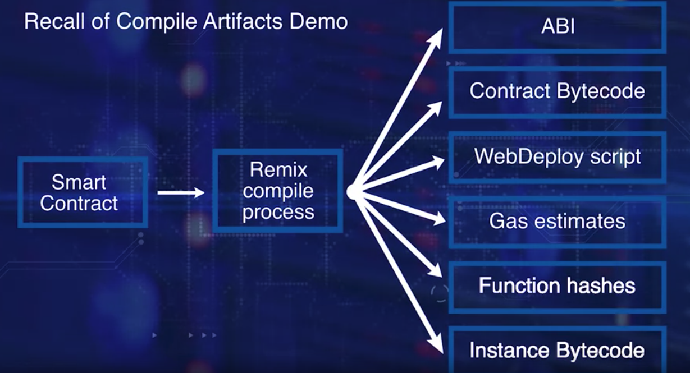
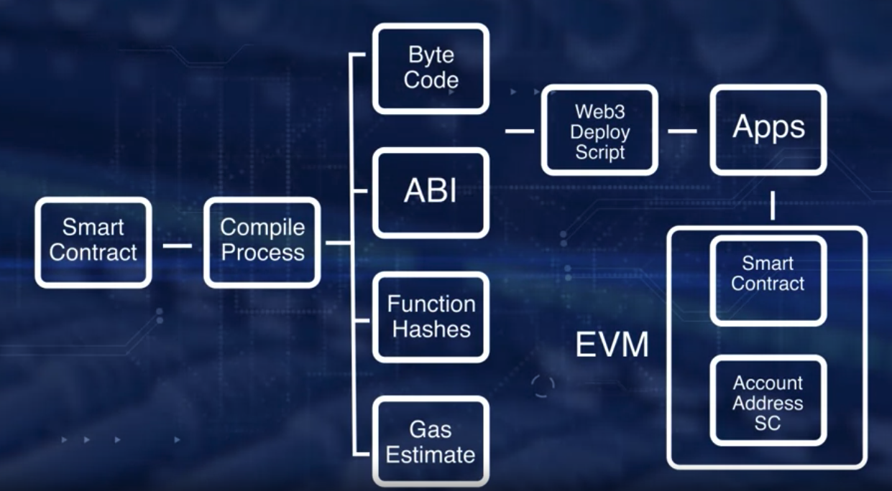
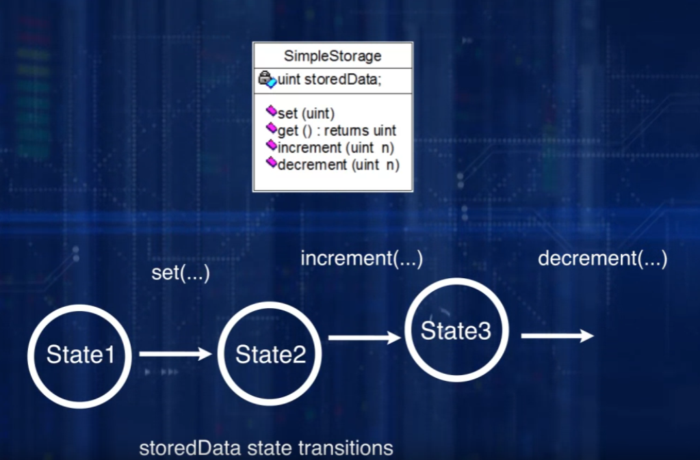

# Course provided by Coursera
* [Course Link](https://www.coursera.org/learn/smarter-contracts)

# Week 1 - Smart Contract Basics: Why Smart Contracts?

## Why Smart Contracts?

* The concept of the smart contract was there well before the advent of the Bitcoin.
* Computer Scientist Nick Szabo detailed his idea of cryptocurrency Bit gold as a sort of a precursos for Bitcoin.
  * He also outlined the concept of smart contract in his 1996 publication.
  * He coined the term smart contract more than 20 years ago.

* Smart contract is a centerpiece and main thrust of Ethereum blockchain

* Powerful Feature
  * Improper design and coding of a smart contract, resulted in significant failures such as DAO hack and Parity Wallet Lockup.

* Bitcoin has a script feature that includes rules and policies
* Linux Foundation's Hyperledger blockchain has a smart contract feature called Chaincode
  * Chaincode is written in go language, and executed in a docker environment

* Many variations of smart contracts are prevalent in the blockchain context.
  * We have chosen to discuss Ethereum implementation of smart contracts since Ethereum is a general mainstream blockchain, and it is beign used as a reference blockchain for many others

* A significant contribution of Ethereum is a working smart contract layer that supports any arbitrary code execution over the blockchain
  * Smart contract allows for user-defined operations of arbitrary complexity.
  * This feature enhaces the capability of Ethereum blockchain to be a powerful decentralized computing system.

* Cryptocurrency introduces conditions, rules, policies beyond that of which a simple money transfer cryptocurrency protocols can handle.
  * Smart contract addresses this need for application specific validation for blockchain applications.
  * Smart Contract allows specificication of rules for an operation on the blockchain. It facilitaates implmenetation of policies for transfer of assets in a decentralized network.
  * Adds programmability and intelligence to the blockchain.
  * The smart contract represents a business logic layer, with the actual logic cded in a special high level language.
  * A Smart contract embeds function that can be invoked by messages that are like function calls. These messages and the input parameters for a single message are specified in a transaction.

* Bitcoin Transactions X Smart Contract Transaction
  * In Bitcoin, all the transactions are about send value.
  * In the case of a blockchain that supports a smart contract, a transaction could embed a function implemented by a smart contract
  * Smart contract provides a layer of computation logic that can be executed on the blockchain, thus availing the features enabled by the blockchain framework.

* Consider home mortgage application
  * Smart contract could embed all the business logic and the intelligence for the rules and regulation, to allow for automatic computation and initiation of operation.
  * How might this be different from existem systems?
    * The operations are transparent and are recorded on the blockchain.
    * Customers can directly access the tools without an intermediary like a bank.
    * Like ATM for mortgage initiation

* Problems a smart contract can solve
  * Typically, currency transfer is used to buy a service, a product, or a utility from a person or a business. There may be other conditions besides availability of funds while executing a transaction. For example, a busnisess transaction may involve rules, policies, laws, regulations, and governing contexts.
  * Smart contract allows for these other real world contraints to be realized on a blockchain, thus a smart cotnract enables a wide variety of decentralized application of arbirary complexity to be implemented on the blockchain

### Resources: Why Smart Contracts?

* [Smart Contract: Building blocks for digital markets](https://www.fon.hum.uva.nl/rob/Courses/InformationInSpeech/CDROM/Literature/LOTwinterschool2006/szabo.best.vwh.net/smart_contracts_2.html)
* [How to learn Solidity: The Ultimate Ethereum Coding Guide](https://blockgeeks.com/guides/solidity/)
* [Remix - Solidity IDE](https://remix-ide.readthedocs.io/en/latest/)

### Quiz

* 1 - Who coined the phrase "smart contract"?
  * A: Nick Szabo

* 2 - Smart Contract is the centerpiece of Ethereum blockchain. What is another smart contract model?
  * Chaincode of Hyperledger

* 3 - What does a smart contract represent?
  * Business logic layer

* 4 - How does a smart contract transaction differ from the usual cryptocurrency transfer (say. Bitcoin)?
  * It enables asset transfer in addition to digital currency

* 5 - An important characteristic of a decentralized network enabled by the blockchain technology is that **YOU HOLD THE ASSETS INSTEAD OF THE INTERMEDIARIES**

### Smart Contracts that will be used in this course

* [Smart Contracts](smart-contracts-solidity-0.5.9/)

## Smart Contracts Defined

## Remix IDE and Greeter Demos

* A smart contract can be created, on behalf of an externally owned account, by application programmatically from the command-line interface and by a script of commands from high level applications and user interface or UI.
  * It can also be created from inside a smart contract

* We need an address for the smart contract to deploy it and invoke its functions.
  * The address is computed by hashing the account number of Externally Owned Account (EOA) and the nonce

* Artifacts generated by the [Remix](https://remix.ethereum.org/) Smart Contract Compile Process:
  * ABI - Application Binary Interface
    * The interface schema for a transaction to invoke functions on the smart contrac tinstance bytecode.
    * This is the bytecode that is executed for instantiating a smart contract on the EVM
    * Think of it like executing a constructor of a smart contract to create an object.
  * WebDeploy script - Two items
    * JSON script to web application to invoke smart contract function
    * Script for programmatically deploying a smart cotnract from a web applciation
  * Gas estamites
    * Provides a gas estimates for deploying the smart contract and for the function invocation
  * Function hashes
    * First four byte of the function signatures to facilitate function invocation by a transaction
  * Instance bytecode
    * Bytecode of the smart contract instance

### Rsources: Processing Smart Contracts

* [Account Types, Gas, and Transactions](https://ethereum.org/en/developers/docs/accounts/)

### Quiz

* 1 - What is a CLI?
  * Command Line Interface

* 2 - You cannot execute a smart contract from another smart contract. True or False?
  * False

## Deployment Smart Contracts

* Smart Contract Deployment Process
  * Smart Contract solution is written in high-level language and compiled bytecode
  * An ABI is also generated for high-level language application
    * Ex: Web Apps to interact with the binary smart contract
  * EVM provides execution environment for a smart contract bytecode
  * The smart contract requires an address for itself so that transaction can target it for invocation of its function
  * The contract address is generated by hashing the sender's account address and its nonce.
  * A unique target account is reserved for smart contract creation and deployment
  * Target account zero
    * If a target's address is zero or null, it is meant for creating a new smart contract using its payload feed.
    * The payload of a transaction contains the bytecode for the smart contract
    * This code is executed as a part of the transaction execution to instantiate the bytecode for the acutal smart contract
  * The execution of a smart contract creation transaction results in the deployment of this smart contract code on the EVM
  * It is permanently stored in the EVM for future invocation
  * This transaction goes through all the regular verification and validation specified in the ethereum blockchain protocol.
    * Block creation
    * Transaction Confirmation by the full nodes deploys the same contract on all the nodes
    * This provies consistent execution when the regular transaction with function messages are invoked on the smart cotnract
  
* There are many other approaches for deploying this smart contract
  * They can be deployed from Remix IDE
  * Another Smart contract
  * A command line interface
  * Another high-level language application 
  * Web application

### Resources: Deploying Smart Contracts

* [Ethereum, Tokens, and Smart Contracts](https://k3no.medium.com/ethereum-tokens-smart-contracts-80f639f5c46b)
* [Decoding the Enigma of Bitcoin Mining](https://medium.com/all-things-ledger/decoding-the-enigma-of-bitcoin-mining-f8b2697bc4e2)

### Quiz

* 1 - Which of the following are used to determine the address of a contract? (Select 2)
  * Address of the creator's account
  * Nonce of the creator's account

## Week 1 Evaluation: Smart Contract Basics

* [Smart Contracts](smart-contracts-solidity-0.5.9/)* Since a smart contract is deployed in the blockchain, it is an immutable piece of code, and oce deployed, it cannot be changed. 
* We will have to redeploy the code as a new smart contract, or somehow redirect the calls from a old contract to the new one.
* Smart contract can sotre variables in it called state variables.

* Contract in the Ethereum blockchain has
  * pragma directive
  * name of the contract
  * data or the state variable that define the state of the contract
  * collection of function to carry out the intent of a smart contract
  * identifiers representing these elements are restricted to ASCII character set
  * Make sure you select meaniingful identifiers and follow camel case convertion in naming them

* [Gretter.sol](smart-contracts-solidity-0.5.9/Greeter.sol)

* Add the above contract in the remix ide, compile it and deploy it, checking its functions and variables in order to interact with it.

## Simple Storage Demo

* [SimpleStorage.sol](smart-contracts-solidity-0.5.9/SimpleStorage.sol)

* About this particular smart contract, imagine a big number that a whole world could share.
  * A simple de-centralized use case is wolrd population.
  * Count to something that is distributed all over the planet
  * This particular smart contract has get, set, increment and decrement as funcitons
  * You may expand these to more sophisticated operations such as, dig the soil and evaluate the acidity. Identification of an isolated Ebola patient. Work with a remote supply of rare mineral, management of land deeds and any number of decentralized application

### Resources: Smart Contract Defined

* [Structure of a Contract](https://docs.soliditylang.org/en/develop/structure-of-a-contract.html)
* [Camel Case](https://docs.soliditylang.org/en/develop/structure-of-a-contract.html)
* [Introduction to Smart Contracts](https://docs.soliditylang.org/en/develop/introduction-to-smart-contracts.html)

### Quiz

* 1 - What is a standard notation used for representing identifiers?
  * Camel Case

* 2 - According to Ethereum Metropolis version, once a smart contract is deployed it is immutable. True or False?
  * True

## Processing Smart Contracts (Compile Artifacts Demo)