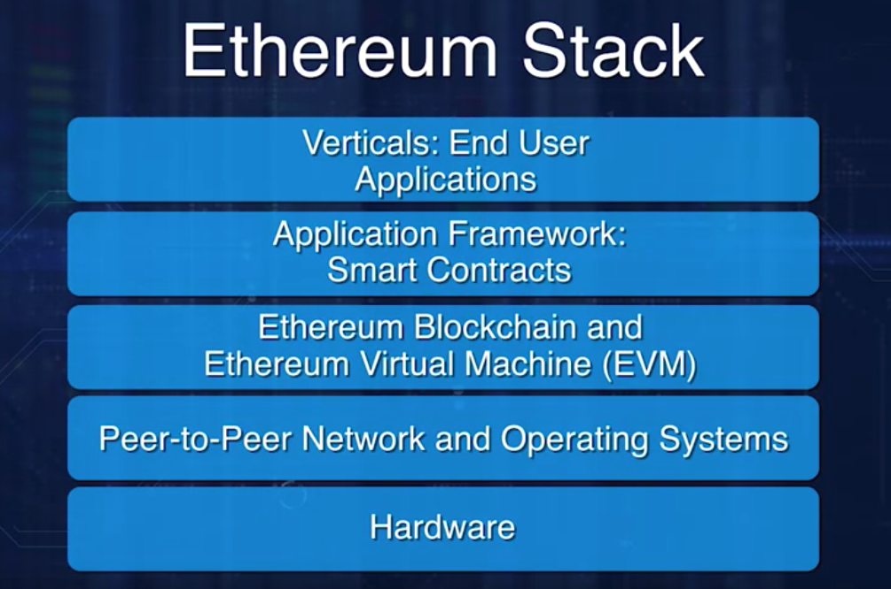

# Course provided by Coursera
* [Course Link](https://www.coursera.org/learn/smarter-contracts)

# Week 1 - Smart Contract Basics: Why Smart Contracts?

* The concept of the smart contract was there well before the advent of the Bitcoin.
* Computer Scientist Nick Szabo detailed his idea of cryptocurrency Bit gold as a sort of a precursos for Bitcoin.
  * He also outlined the concept of smart contract in his 1996 publication.
  * He coined the term smart contract more than 20 years ago.

* Smart contract is a centerpiece and main thrust of Ethereum blockchain

* Powerful Feature
  * Improper design and coding of a smart contract, resulted in significant failures such as DAO hack and Parity Wallet Lockup.

* Bitcoin has a script feature that includes rules and policies
* Linux Foundation's Hyperledger blockchain has a smart contract feature called Chaincode
  * Chaincode is written in go language, and executed in a docker environment

* Many variations of smart contracts are prevalent in the blockchain context.
  * We have chosen to discuss Ethereum implementation of smart contracts since Ethereum is a general mainstream blockchain, and it is beign used as a reference blockchain for many others

* A significant contribution of Ethereum is a working smart contract layer that supports any arbitrary code execution over the blockchain
  * Smart contract allows for user-defined operations of arbitrary complexity.
  * This feature enhaces the capability of Ethereum blockchain to be a powerful decentralized computing system.

* Cryptocurrency introduces conditions, rules, policies beyond that of which a simple money transfer cryptocurrency protocols can handle.
  * Smart contract addresses this need for application specific validation for blockchain applications.
  * Smart Contract allows specificication of rules for an operation on the blockchain. It facilitaates implmenetation of policies for transfer of assets in a decentralized network.
  * Adds programmability and intelligence to the blockchain.
  * The smart contract represents a business logic layer, with the actual logic cded in a special high level language.
  * A Smart contract embeds function that can be invoked by messages that are like function calls. These messages and the input parameters for a single message are specified in a transaction.

* Bitcoin Transactions X Smart Contract Transaction
  * In Bitcoin, all the transactions are about send value.
  * In the case of a blockchain that supports a smart contract, a transaction could embed a function implemented by a smart contract
  * Smart contract provides a layer of computation logic that can be executed on the blockchain, thus availing the features enabled by the blockchain framework.

* Consider home mortgage application
  * Smart contract could embed all the business logic and the intelligence for the rules and regulation, to allow for automatic computation and initiation of operation.
  * How might this be different from existem systems?
    * The operations are transparent and are recorded on the blockchain.
    * Customers can directly access the tools without an intermediary like a bank.
    * Like ATM for mortgage initiation

* Problems a smart contract can solve
  * Typically, currency transfer is used to buy a service, a product, or a utility from a person or a business. There may be other conditions besides availability of funds while executing a transaction. For example, a busnisess transaction may involve rules, policies, laws, regulations, and governing contexts.
  * Smart contract allows for these other real world contraints to be realized on a blockchain, thus a smart cotnract enables a wide variety of decentralized application of arbirary complexity to be implemented on the blockchain

### Resources: Why Smart Contracts?

* [Smart Contract: Building blocks for digital markets](https://www.fon.hum.uva.nl/rob/Courses/InformationInSpeech/CDROM/Literature/LOTwinterschool2006/szabo.best.vwh.net/smart_contracts_2.html)
* [How to learn Solidity: The Ultimate Ethereum Coding Guide](https://blockgeeks.com/guides/solidity/)
* [Remix - Solidity IDE](https://remix-ide.readthedocs.io/en/latest/)

### Quiz

* 1 - Who coined the phrase "smart contract"?
  * A: Nick Szabo

* 2 - Smart Contract is the centerpiece of Ethereum blockchain. What is another smart contract model?
  * Chaincode of Hyperledger

* 3 - What does a smart contract represent?
  * Business logic layer

* 4 - How does a smart contract transaction differ from the usual cryptocurrency transfer (say. Bitcoin)?
  * It enables asset transfer in addition to digital currency

* 5 - An important characteristic of a decentralized network enabled by the blockchain technology is that **YOU HOLD THE ASSETS INSTEAD OF THE INTERMEDIARIES**

### Smart Contracts that will be used in this course

* [Smart Contracts](smart-contracts-solidity-0.5.9/)

## Smart Contracts Defined

## Remix IDE and Greeter Demos

