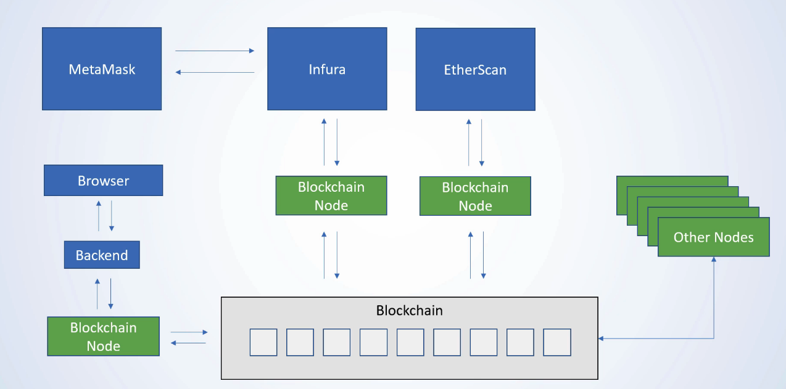
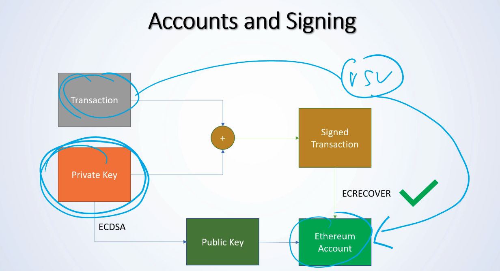
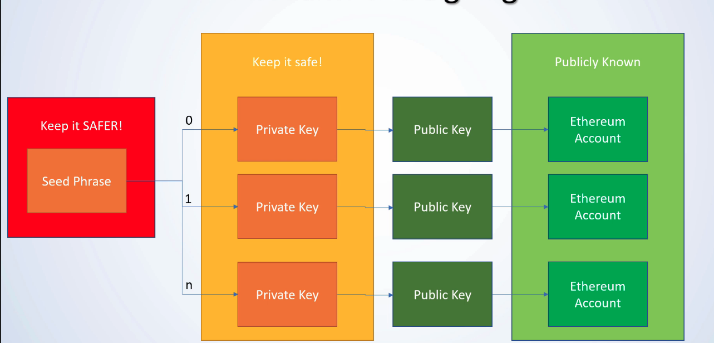
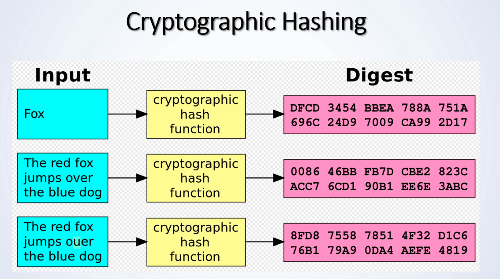
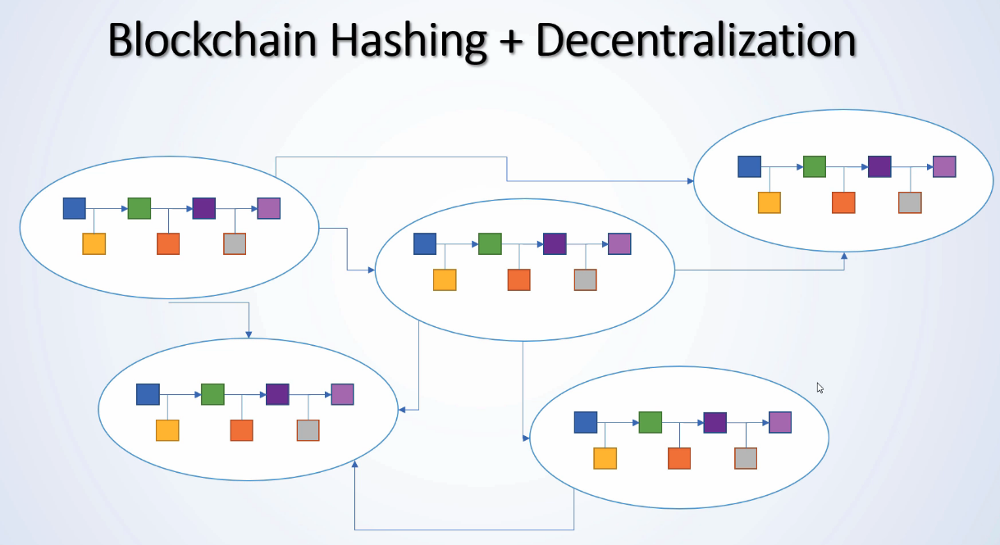
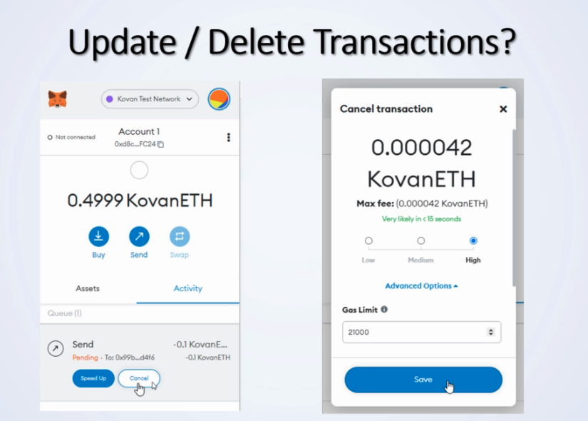
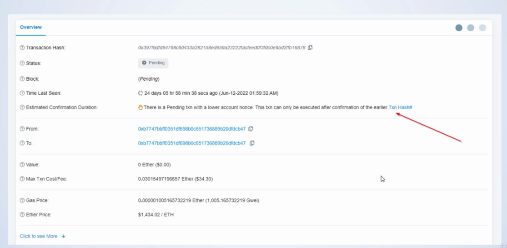

# Course
[Course link](https://www.udemy.com/course/blockchain-developer)

# Remix IDE

## Setup Remix
* http://remix.ethereum.org/ | https://remix.ethereum.org/
  * HTTP vs HTTPS
  * Be careful with the https vs http domain. Remix stores edited files in localstorage of the browser. If your smart contracts are suddenly gone, look at the protocol.
  * In this course we work with http, not https. This is especially important later when we do private blockchains which require CORS to be setup correctly. 
* https://ethereum-blockchain-developer.com/2022-01-remix-introduction/01-setup-remix/

## Starting, Stopping and Interacting with Smart Contracts

* https://ethereum-blockchain-developer.com/2022-01-remix-introduction/02-starting-stopping-interacting/

```solidity
//SPDX-License-Identifier: MIT

pragma solidity 0.8.14;

contract MyContract {

    string public ourString = "Hello World";

}
```


* Wondering what that all means?
  * This is a very basic version of a Smart Contract. Let's go through it line by line:
  * // SPDX-License-Identifier: GPL-3.0: The The Software Package Data Exchange® (SPDX®) identifier is there to clearly communicate the license under which the Solidity file will be made available. Well, if you make it available. But you should. Smart Contracts transparency and trust greatly benefit from the source being published and sometimes it's not 100% clear under which license the source is out in the wild. The SPDX identifier is optional, but recommended.
  * pragma solidity 0.8.14: The pragma keyword is for the compiler to enable certain features or check certain things. The version pragma is a safety measure, to let the compiler know for which compiler version the Solidity file was written for. It follows the SemVer versioning standard. 0.8.14 only version 0.8.14, but if we'd write it as pragma solidity ^0.8.0 it would mean >=0.8.0 and <0.9.0.
  * contract MyContract: That's the actual beginning of the Smart Contract. Like a Class in almost any other programming language.
  * string public myString = 'hello world': That is a storage variable. It's public and Solidity will automatically generate a getter function for it - you'll see that in a minute!

# Blockchain basics

## What is a smart contract
  * "smart contracts" was coined by computer scientist Nick Szabo in 1994
  * A piece of code running on the blockchain
    * It's a state machine
    * Needs transactions to change state
    * Can do logic operations
  
  * Statechange happens through mining+transacations

  * It's turing complete
    * That means in theory it can solve any computation problem

## Smart Contract Programming Languages
  * Solidity
  * Vyper (Vitalik)
  * LLL
  * All run on EVM and generates a bytecode

## Solidity
  * The most popular language
    * This course is building upon it
  * It's compared to Javascript
    * ECMA Script
  * Every "high language" code compiles to Bytecode
  * Every Ethereum node in the network executes the same code
    * Because every node has a copy of the chain

## Other languages
  * Serpent
    * Similar to Python
  * LLL
    * Like low-level LISP
  * Mutan
    * Deprecated Go-based language
  * Vyper
    * Research-oriented, derived from Python

## Deployment
  * During deployment we sent off a transcation
  * The data-field was populated
  * The data in the data field is the compiled byte-code
  * Code deployed on the blockchain

## Key Take-Aways
  * Smart Contracts are running on the blockchain
    * Deployed as EVM Bytecode
  * They are turing complete
  * The structure looks probably familiar
  * Deployment is done with a transaction

# Read and Write to Smart Contract

```solidity
//SPDX-License-Identifier: MIT

pragma solidity 0.8.14;

contract MyContract {

    string public ourString = "Hello World";

    function updateOurString(string memory _updateString) public { 
        ourString = _updateString;

    } 

}
```

* Variable naming
  * According to the [Naming Conventions](https://docs.soliditylang.org/en/v0.4.25/style-guide.html#naming-conventions) a variable should be mixedCase, without a leading underscore. Turns out I was wrong teaching you a leading underscore (_variableName) - I still use it in my contracts as I like the distinction between JavaScript, Web3js and Solidity. But I need to mention it here: If you want to write Smart Contracts according to the official suggested naming convention, write variables only as mixedCase

# [Project] The Blockchain Messenger

## Booleans
* All variables in Solidity are initialized with their default value. There is no undefined or null!
```solidity
//SPDX-License-Identifier: MIT

pragma solidity 0.8.14;

contract ExampleBoolean {

    // default value = false
    // 0 = true
    // any character = true
    // empty and false = false
    bool public myBool;

    function setMyBool(bool _myBool) public {
        // myBool = _myBool;
        myBool = !_myBool;
    }

}

```

## (Unsigned) Integers
* [LAB](https://ethereum-blockchain-developer.com/2022-02-solidity-basics-blockchain-messenger/02-integer/)
```solidity
//SPDX-License-Identifier: MIT

pragma solidity 0.8.14;

contract ExampleUint {

    // default = 0
    // possible initialize
    // initialization costs extra gas
    uint public myUint = 83321;

    uint256 public myUint256; //Stores 0 - (2ˆ256) - 1 

    uint8 public myUint8; // 0 - 255 or (2ˆ8) - 1

    int public myInt = -10; // -2ˆ128 to +2ˆ128 -1

    function setMyUint(uint _myUint) public {
        myUint = _myUint;
    }

    function decrementUint() public {
        myUint--;
    }

    function increementUint8() public {
        myUint8++;
    }

    function increementInt() public {
        myInt++;
    }
}
```


## Integer Rollover - SafeMath

* [LAB](https://ethereum-blockchain-developer.com/2022-02-solidity-basics-blockchain-messenger/03-integer-rollovers/)


* What are Overflows or Underflows?¶
  * In previous versions of Solidity (prior Solidity 0.8.x) an integer would automatically roll-over to a lower or higher number. If you would decrement 0 by 1 (0-1) on an unsigned integer, the result would not be -1, or an error, the result would simple be: type(uint).max.

  * For this example I want to use uint8. In our previous example worked with uint256 and uint8 and did not roll over. Uint8 is going from 0 to 2^8 - 1. In other words: uint8 ranges from 0 to 255. If you increment 255 it will automatically be 0, if you decrement 0, it will become 255 if the operation is unchecked. No warnings, no errors. For example, this can become problematic, if you store a token-balance in a variable and decrement it without checking.

* Solidity 0.7 example

```solidity
//SPDX-License-Identifier: MIT

pragma solidity 0.7.0;

contract ExampleWrapAround {

    uint8 public myUint8 = 250; 

    function decrement() public {
        myUint8--;
    }

    function increment() public {
        myUint8++;
    }
}
```
* If you deploy this and run "increment" more than 5 time, the myUint8 will just magically start from 0 again. No warning.

* Of course, sometimes this behavior is actually beneficial. Imagine you want to run something indefinitely and just do something on every even number. To save gas, you'd naturally use an uint8 and do var % 2 == 0. That way it rolls over and nobody actually cares.

* The problem is, those cases are actually pretty rare. Normally, we don't want an integer to roll over. That's why in 0.8 it changed to be the default behavior to error out if the maximum/minimum value is reached. But you can still enforce this behavior. With an unchecked block. Let's see an example.

* Solidity 0.8 unchecked example

```solidity 
//SPDX-License-Identifier: MIT

pragma solidity 0.8.15;

contract ExampleWrapAround {
    uint256 public myUint;

    function decrementUintUnchecked() public {
        unchecked {
            myUint--;
        }
    }

    function decrementUint() public {
        myUint--;
    }
}

```

## Strings and Bytes

* [LAB](https://ethereum-blockchain-developer.com/2022-02-solidity-basics-blockchain-messenger/04-strings-bytes/)

* Strings are actually Arrays, very similar to a bytes-array. If that sounds too complicated, let me break down some quirks for you that are somewhat unique to Solidity:

  * Natively, there are no String manipulation functions.
  * No even string comparison is natively possible
  * There are libraries to work with Strings
  * Strings are expensive to store and work with in Solidity (Gas costs, we talk about them later)
  * As a rule of thumb: **try to avoid storing Strings, use Events instead (more on that later as well!)**

```solidity
//SPDX-License-Identifier: MIT

pragma solidity 0.8.15;

contract ExampleStrings {

    string public myString = "Hello World";
    //EACH CHARACTER HAS 1 BYTE
    bytes public myBytes = "Hello World";
    //THE CHARACTER ö HAS 2 BYTES
    bytes public myBytes2 = "Hello Wörld";

    function setMyString(string memory _myString) public {
        myString = _myString;
    }
    // comparing two strings
    function compareTwoStrings(string memory _myString) public view returns(bool) {
        return keccak256(abi.encodePacked(myString)) == keccak256(abi.encodePacked(_myString));
    }
}
```

* Strings vs Bytes

  * Strings are actually arbitrary long bytes in UTF-8 representation. Strings do not have a length property, bytes do have that. Let's run an example and add a bytes variable with the same "Hello World".
  * The character "ö" needs 2 bytes.

## Addresses Types

* [LAB](https://ethereum-blockchain-developer.com/2022-02-solidity-basics-blockchain-messenger/05-ethereum-addresses/)
* One type, which is very specific to Ethereum and Solidity, is the type "address".
* Ethereum supports transfer of Ether and communication between Smart Contracts. Those reside on an address. Addresses can be stored in Smart Contracts and can be used to transfer Ether from the Smart Contract to to an address stored in a variable.
* That's where variables of the type address come in.
* In general, a variable of the type address holds 20 bytes. That's all that happens internally. Let's see what we can do with Solidity and addresses.

### IMPORTANT CONCEPTS

* As you continue, please pay special attention to the following few concepts here which are really important and different than in any other programming language:

  * The Smart Contract is stored under its own address
  * The Smart Contract can store an address in the variable "someAddress", which can be its own address, but can be any other address as well.
  * All information on the blochain is public, so we can retrieve the balance of the address stored in the variable "someAddress"
  * The Smart Contract can transfer funds from his own address to another address. But it cannot transfer the funds from another address.
  * Transferring Ether is fundamentally different than transferring ERC20 Tokens or NFTs, as you will see later.
  * Before you continue, read the statements above and keep them in mind. These are the most mind-blowing facts for Ethereum newcomers.

### Ethereum Denominations

|Unit |Wei Exp|Wei
|-----|-------|---|
|wei  |1	    |1
|Kwei	|10^3	  |1,000
|Mwei	|10^6	  |1,000,000
|Gwei	|10^9	  |1,000,000,000
|Ether|10^18	|1,000,000,000,000,000,000

## Writing, View and Pure Functions

* [LAB](https://ethereum-blockchain-developer.com/2022-02-solidity-basics-blockchain-messenger/07-writing-view-pure-functions/)

* So far, we have mostly interacted and modified state variables from our Smart Contract. For example, when we write the address, we modify a state variable. When we update an uint variable, we also modify the state.
* For this, we needed to send a transaction. That works very transparently in Remix and also looks instantaneous and completely free of charge, but in reality it isn't. Modifying the State costs gas, is a concurrent operation that requires mining and doesn't return any values.
* Reading values, on the other hand, is virtually free and doesn't require mining.
* There are two types of reading functions:
  * view: Accessing state variables
  * pure: Not accessing state variables


### Writing Functions
* As before, let's quickly create a state-modifing writing function:

```solidity

//SPDX-License-Identifier: MIT

pragma solidity 0.8.15;

contract ExampleViewPure {

    uint public myStorageVariable;

    function setMyStorageVariable(uint _newVar) public returns(uint) {
        myStorageVariable = _newVar;
        return _newVar;
    }


}

```

* As you can see here, a writing function can have return variables, but they won't actually return anything to the transaction initializer. There are several reason for it, but the most prominent one is: at the time of sending the transaction the actual state is unknown. It is possible that someone sends a competing transaction that alters the state and from there it only depends on the transaction ordering - which is something that happens on the miner side. You will see that extensively in the next section.

* What's the return variable for then?

* It's for Smart Contract communication. It is used to return something when a smart contract calls another smart contract function.

* How to return variables then in Solidity? With Events! Something we're talking about later on.


### View Functions

* A view function is a function that reads from the state but doesn't write to the state. A classic view function woule be a getter-function. Let's extend the smart contract and write one:

```solidity
//SPDX-License-Identifier: MIT

pragma solidity 0.8.15;

contract ExampleViewPure {

    uint public myStorageVariable;

    function getMyStorageVariable() public view returns(uint) {
        return myStorageVariable;
    }

    function setMyStorageVariable(uint _newVar) public returns(uint) {
        myStorageVariable = _newVar;
        return _newVar;
    }


}
```
### Pure Functions
* A pure function is a function that neither writes, nor reads from state variables. It can only access its own arguments and other pure functions. Let me give you an example:

```solidity
//SPDX-License-Identifier: MIT

pragma solidity 0.8.15;

contract ExampleViewPure {

    uint public myStorageVariable;

    function getMyStorageVariable() public view returns(uint) {
        return myStorageVariable;
    }

    function getAddition(uint a, uint b) public pure returns(uint) {
        return a+b;
    }

    function setMyStorageVariable(uint _newVar) public returns(uint) {
        myStorageVariable = _newVar;
        return _newVar;
    }


}
```

## Understanding The Constructor

* [LAB](https://ethereum-blockchain-developer.com/2022-02-solidity-basics-blockchain-messenger/08-solidity-constructor/)

* The constructor is a special function. It is automatically called during Smart Contract deployment. And it can never be called again after that.


## The Blockchain Messenger Implementation

* [LAB](https://ethereum-blockchain-developer.com/2022-02-solidity-basics-blockchain-messenger/10-the-blockchain-messenger/)

* In this project, you are going to implement a simple messenger functionality in a Smart Contract.
  * Through the constructor make sure you write the address that deployed the contract to a variable
  * Create a message-variable of the type string, that only the deployer-address can update
  * Create a counter, to see how many times the variable was updated.


```solidity
//SPDX-License-Identifier: MIT

pragma solidity 0.8.15;

contract TheBlockchainMessenger {

    uint public changeCounter;

    address public owner;

    string public theMessage;

    constructor() {
        owner = msg.sender;
    }

    function updateTheMessage(string memory _newMessage) public {
        if(msg.sender == owner) {
            theMessage = _newMessage;
            changeCounter++;
        }
    }
}

```

# Section 4: [Project] Smart Money - Deposit And Withdrawals

## Installing And Configuring MetaMask

* That is a browser plugin which can securely store private keys and connect to different blockchains.
* [LAB](https://ethereum-blockchain-developer.com/2022-03-deposit-withdrawals/01-installing-configuring-metamask/)


## Get Free Ether And Send Transactions

* [LAB](https://ethereum-blockchain-developer.com/2022-03-deposit-withdrawals/02-getting-testnet-ether/)
* Network Selection
  * Attention here: some of the pictures have "Ropsten" selected, but the Ropsten test-network had a couple of hiccups, so I recommend Goerli instead!

  * Also, since the PoS Merge, Kovan and Rinkeby are getting deprecated. Sepolia is not very reliable in my opinion. Best is, to try Görli.

* Faucets
  * Sometimes Faucets don't work as expected. Unfortunately there is nothing much that I can do about it. It is time intensive to run a faucet and usually it doesn't pay off economically. Here is a list of Faucets in case the one here doesn't work, you can probably switch to another one:

  * My current go-to Faucet I really like for all networks: https://faucet.paradigm.xyz

  * Ropsten: https://faucet.metamask.io

  * Rinkeby: https://faucet.rinkeby.io https://www.rinkebyfaucet.com https://app.mycrypto.com/faucet https://faucets.chain.link/rinkeby

  * Kovan: https://gitter.im/kovan-testnet/faucet basically post your eth address in the gitter chat

  * Görli: https://fauceth.komputing.org/?chain=5 https://goerli-faucet.slock.it/index.html https://faucet.goerli.mudit.blog

  * Another "special edition" Faucet is maintained by Keir "Blockchain-Gandalf" Finlow-Bates, who also wrote a great book about Blockchains. He tries to maintain it as good as possible and it outputs Ropsten Ether: https://moonborrow.com

  * Kintsugi (Eth2.0): https://kintsugi.themerge.dev

## (Behind The Scenes) Metamask

* Metamask -> RPC -> Infure > Blockchain Node -> Blockchain
* Infura
  * Service Provider
  * Runs its own blockchain nodes internally in the datacenters
  * They have convenient access to those blockchain nodes and the blockchain nodes itself
  * They are storing or they are sincronyzing the data with the blockchain and alaways keeping it up to date
  * Uses RPC

* Key Take-Aways
  * You need a blockchain node to interact with the Blockchain
  * The Blockchain is the single source of truth
  * There are infrastructure providers to abstract running Blockchains aways



## (Behind The Scenes) An Ethereum Transaction

* [WEB3JS Documentation](https://web3js.readthedocs.io/en/v1.2.11/web3-eth.html)

* sendTransaction function

```js
web3.eth.sendTransaction(transactionObject [, callback])
```

* Parameters

* 1 - **Object** - The transaction object to send:
  * from - String | Number: The address for the sending account. Uses the web3.eth.defaultAccount property, if not specified. Or and address or index of a local wallet in web3.eth.accounts.wallet.
  * to - String: (optional) The destination address of the message, left undefined for a contract-creation transaction.
  * value - Number|String|BN|BigNumber: (optional) The value transferred for the transaction in **wei**, also the endowment if it’s a contract-creation transaction.
  * gas - Number: (optional, default: To-Be-Determined) The amount of gas to use for the transaction (unused gas is refunded).
  * gasPrice - Number|String|BN|BigNumber: (optional) The price of gas for this transaction in wei, defaults to web3.eth.gasPrice.
  * data - String: (optional) Either a ABI byte string containing the data of the function call on a contract, or in the case of a contract-creation transaction the initialisation code.
  * nonce - Number: (optional) Integer of the nonce. This allows to overwrite your own pending transactions that use the same nonce.
  * chain - String: (optional) Defaults to mainnet.
  * hardfork - String: (optional) Defaults to petersburg.
  * common - Object: (optional) The common object
  * customChain - Object: The custom chain properties
  * name - string: (optional) The name of the chain
  * networkId - number: Network ID of the custom chain
  * chainId - number: Chain ID of the custom chain
  * baseChain - string: (optional) mainnet, goerli, kovan, rinkeby, or ropsten
  * hardfork - string: (optional) chainstart, homestead, dao, tangerineWhistle, spuriousDragon, byzantium, constantinople, petersburg, or istanbul
* 2 - callback - Function: (optional) Optional callback, returns an error object as first parameter and the result as second.


* How does "the Blockchain" know that the transaction is not malicious? Or, in other words:
* How does the Blockchain know it's allowed to transfer [value] from account [from] to account [to]?

* Ethereum Transaction Signature

* signTransaction function
  * [WEB3JS Documentation](https://web3js.readthedocs.io/en/v1.2.11/web3-eth.html#signtransaction)

```js
web3.eth.signTransaction({
    from: "0xEB014f8c8B418Db6b45774c326A0E64C78914dC0",
    gasPrice: "20000000000",
    gas: "21000",
    to: '0x3535353535353535353535353535353535353535',
    value: "1000000000000000000", ---> wei amount
    data: ""
}).then(console.log);
> {
    raw: '0xf86c808504a817c800825208943535353535353535353535353535353535353535880de0b6b3a76400008025a04f4c17305743700648bc4f6cd3038ec6f6af0df73e31757007b7f59df7bee88da07e1941b264348e80c78c4027afc65a87b0a5e43e86742b8ca0823584c6788fd0',
    tx: {
        nonce: '0x0',
        gasPrice: '0x4a817c800',
        gas: '0x5208',
        to: '0x3535353535353535353535353535353535353535',
        value: '0xde0b6b3a7640000',
        input: '0x',
        v: '0x25',
        r: '0x4f4c17305743700648bc4f6cd3038ec6f6af0df73e31757007b7f59df7bee88d',
        s: '0x7e1941b264348e80c78c4027afc65a87b0a5e43e86742b8ca0823584c6788fd0',
        hash: '0xda3be87732110de6c1354c83770aae630ede9ac308d9f7b399ecfba23d923384'
    }
}
```

* Transaction Object:
  * You need a private key and the private key is stored in metamask without really being visible but it uses them and so called **Elliptic Curve Digital Signature Algorithm** (ECDSA) to create the public key and from the public key it creates the Ethereum Account.
  * Private Key
    * 32-bytes (64 hex characters)
    * 0x123451234512345... 64x
  * Public key
    * Uses ECDSA from private key to generate public key
    * 64-bytes long
  * Ethereum Account
    * Keccak Hash of the last 20 bytes of the public key
    * Hashing the public key again and it's taking the last 20 bytes or last 40 hex characters






## (Behind The Scenes) Hashing

### Cryptographic Hashing

* Example: 
  * HashFunction("Hello Rome") => "3289232fd213f2358d823749a908543398fb8473912305898e8210284750394"
  * Response called **digest**



* The ideal cryptographic hash function has **FIVE** main properties
  * 1 - It is deterministic so the same message always results in the same hash.
    * No matter how much time passed
    * No matter on which machine
    * No matter where you are
  * 2 - It is quick to compute the hash value for any given message
    * Sometimes beneficial to slow that down in case to avoid any brute force attacks.
  * 3 - It is infeasible to generate a message from its hash value except by trying all possible messages
    * Brute force attack should be the only viable way of getting back to the message.
    * Should take very long or pretty much forever
  * 4 - A small change to a message should change the hash value so extensively that the new hash value appears uncorrelated with the old hash value
  * 5 - It is infeasible to find two different messages with the same hash value
    * Should not be any collisions
    * One problem with MD5 is that we found or people found a couple of collisions and found that it's in general not a really good hash algorithms
    * Keccak Hash is considered safe. (validate it)

* Blockchain Hashing + Decentralization



* Key Take-Aways
  * Hashing it the mathematical foundation of Blockchains
  * Blocks have Hashes of Previious Blocks
    * Are "chained together"
  * Changing information in a previous block changes all blocks thereafter
  * Blocks are stored decentralized
    * on every participating blockchain-node


## Cancel Or Update Ethereum Transactions

### Update / Delete Transactions?

* [LAB](https://ethereum-blockchain-developer.com/2022-03-deposit-withdrawals/06-cancel-update-transactions/)

* Gas-Price Auction
  * The higher the gas price, the more likely it gets mined

* Send the same transaction nonce with higher gas fee
  * Update: higher gas fee
  * Cancel: Send no data + to = from





* Send the trasncation to yourself, then you will cancel it wrong.
* Send the trasncation to yourself with the same nonce, then you cancel it.
* How do you do it with Metamask
  * From the pending transaction, you have to click on see more to actually get to the nonce, click to the nonce.
  * You also need to have access to the private key that has that is from address. If you don't have it, there's nothing you can do
  * Go to you metamask
  * Advanced tab
  * Scroll down and there you see customize transactions nonce.
  * Turn this on the change to nonce transaction number on confirmation screens
  * Send ether to yourself and set the correct nonce as the same of the stuck transaction

## Remix And The Injected Web3 Provider

* [LAB](https://ethereum-blockchain-developer.com/2022-03-deposit-withdrawals/07-injected-web3-provider/)


## The Payable Modifier And Msg.value

* [LAB](https://ethereum-blockchain-developer.com/2022-03-deposit-withdrawals/07-injected-web3-provider/)

* In order for it to receive Eth, you need to add two things here:

  * you need to add the payable modifier. That is the keyword "payable" right next to the visibility specifier "public"
  * you need to understand the global msg-objects property called value. msg.value.

```solidity

//SPDX-License-Identifier: MIT

pragma solidity 0.8.15;

contract SampleContract {
  string public myString = "Hello World";

  // payable keyword - we have to mark functions that are meant to receive ETH with a payabla modifier
  // now the method can receive ether
  // the ether can be stuck in the contract and as long as we're not sending it away
  // it will stay there forever
  // it is necessary send it back to an address
  function updateString(string memory _newString) public payable {
    // ether is global unit
    // likey gwei. There's a couple of them
    // value get the ether sent to the smart contract
    if(msg.value == 1 ether) {
      myString = _newString;
    
    } else {
      // else send the ether back
      // as sender is just an address it needs to be wrapped in payable casting modifiers
      // with payable every variable of the type address has a transfer function
      // and this transfer function will transfer from the SMART CONTRACT the value to the ADDRESS back
      // now the smart contract can take care of his own money
      // so you can send money to the smart contract, it can be stored there, there is nothign that the logic itself needs to do it is natively on the EVM level and it can send it back
      payable(msg.sender).transfer(msg.value);
    }
  }

}

```

## (The Fallback Functions) Fallback And Receive

* [LAB](https://ethereum-blockchain-developer.com/2022-03-deposit-withdrawals/09-sending-ether-to-smart-contracts/)

* Receive vs Fallback
  * receive() is a function that gets priority over fallback() when a calldata is empty. But fallback gets precedence over receive when calldata does not fit a valid function signature.

```solidity

//SPDX-License-Identifier: MIT

pragma solidity 0.8.15;


// however there is no function on this contract you can do a LOW LEVEL INTERACTIONS
// it will basically just send one single transfer, one single transaction
// By default the SMART CONTRACT CANNOT receive anything
// There's only one chance the smart contract can receive something, and that is by letting another smart contract
// self-destruct with these smart contracts address as a beneficiary
contract SampleFallback {

  //if the constructor is noy payable, then you cannot send a value together witht the deployment
  // the constructor is not payable by default

  uint public lastValueSent;
  string public lastFunctionCalled;
  uint public myUint;

  function setMyUint(uint _myNewUint) public {
    myUint = _myNewUint;
  }

  //receiver function is a function that can receive ether and then it needs to be defined as receive
  // you can execute it as a LOW LEVEL INTERACTION WITHOUT DATA
  // otherwise, if there is a calldata, it will need a fallback function
  // the problem with the receiver function is it can only rely on 2300 gas, which is really low
  // it so called gas steepened because if somebody is sending a transaction without any data
  // or anything to the smart contract, especially if another contract is interacting with this contract
  // and just sending and ether or some value, then it will not have enough gas to actually
  // do something meaninful
  // you cannot even write a function where any call any other function or write any storage variable
  // we are still going to do that because we are providing here enough gas
  // we are sinding enough gas to the smart contract with our transcation, but you cannot rely on it
  // you sould never rely on more than 2300 gas
  receive() external payable {
    lastValueSent = msg.value;
    lastFunctionCalled = "receive";
  }


  // if you have a fallback function that is payable but NO RECEIVE FUNCTION, then no matter if
  // a calldata or there's a data sent, it WILL CALL the FALLBACK FUNCTION
  // payable is optional
  // if you want to have a function that gets called in case no other function matches the data
  // then it will hit the fallback function
  // if you want that fallback function to also be able to receive any value, then you add the payable modifier
  fallback() external payable {
    lastValueSent = msg.value;
    lastFunctionCalled = "fallback";
  }

}


```

## Section Summary

### Functions
* Visibility, Constructor, Fallback

### Setter and Getter Functions
* Writing Transactions: Transactions
* Reading Transactions: Call
* Calls are against a local blockchain node
  * Remember: Everyone has a copy of the blockchain
  * If you don't need to change anything, you don't need to inform other participants
  * Reading is virtually free
* View/Pure Function
  * Earlier called a "constant" function
* View Function: Reading from the State and from other View Functions
* Pure Function: Not reading or modifying the state

### Function Visibility

* Public
  * Can be called internally and externally
* Private
  * Only for the contract, not externally reachable and not via derived contracts
* External
  * Can be called from other contracts
  * Can be called externally
* Internal
  * Only from the contract itself or from derived contracts. Can't be invoked by a transaction.

### Constructor

* A function with the name "constructor(...)"
* Called only during deployment
* Can't be called afterwards
* Is either public or internal

### Fallback Function

* A function with the name "fallback() external [payable]" to receive calldata
* A function with the name "receive() external payable" to receive a value without calldata
* Called when a transaction with the wrong function signature is sent to the smart contract
* Called when the function in the transaction isn't found
* Can only be external
  * Fallback payable is opitional
* Contracts receiving Ether without a fallback function and without a function call will throw an exception
* You cannot completely avoid receiving Ether
  * Miner reward or selfdestruct(address) will forcefully credit Ether
* Worst case: You can only rely on 2300 gas (gas stipend)
  * _contractAddress.transfer(1 ether); send only 2300 gas along
* Forcefully prevent contract execution if called with contract data
  * require(msg.data.length == 0)
    * Exceptions

### Msg.value and address

* Global **msg-object** contains a value property (**in wei**)
* How much wei was sent during this call?

* Address-type variables have a balance (address X = 0x123... X.balance)
* Address type variable can be payable (address payable x)
* Payable addresses can receive a value (x.transfer(...wei))
* The contract itself can have a balance (address(this).balance)

### Key Take-Aways
* Constructor is called only once
* Fallback function is here to receive Ether as a simple transaction
  * Beware of Gas limit
* Getter functions are usually view functions
* View/pure is only against your local blockchain node
  * Don't need minig
* There are payable addresses and addresses have a balance

## The Smart Money Implementation


* [MySmartWallet](contracts-section-4/MySmartWallet.sol)
* [Solution made at the class](contracts-section-4/MySmartWallet.sol)
* [LAB](https://ethereum-blockchain-developer.com/2022-03-deposit-withdrawals/11-the-smart-money-implementation/)
